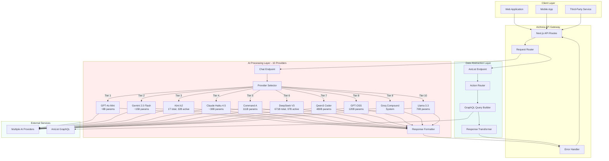
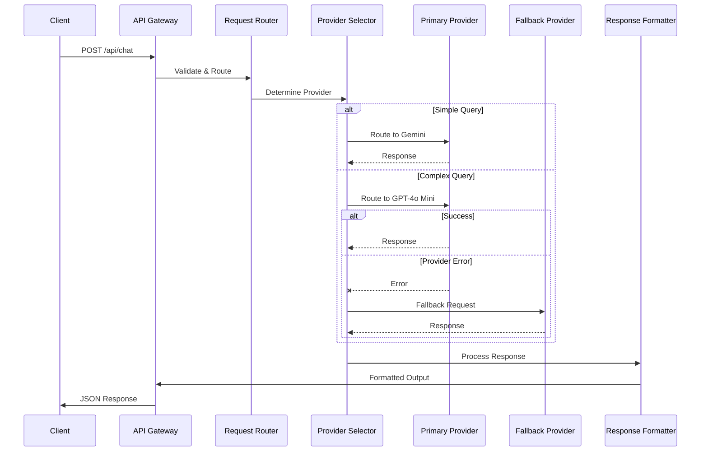
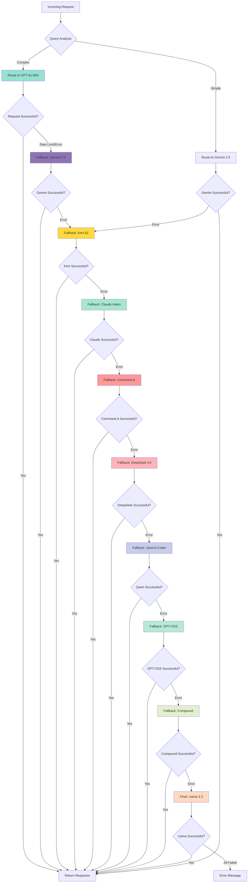
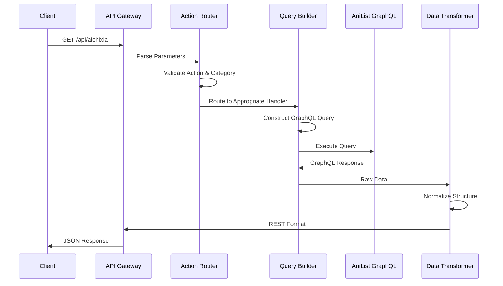

<div align="center">

# Aichixia 5.0

### Intelligent Anime Assistant API

[](https://www.typescriptlang.org/)
[](https://nextjs.org/)
[](https://anilist.co/)

</div>

---

## Overview

**Aichixia 5.0** is an API platform that combines artificial intelligence with comprehensive anime data services. Built on Next.js and TypeScript, it serves as the backend for anime, manga, manhwa, manhua, and light novel applications.

The platform consists of two complementary API surfaces designed to work independently or in tandem:

**AI Conversation Engine** - Multi-provider natural language interface featuring 10 AI models with intelligent fallback architecture totaling approximately **2.5 trillion parameters**.

**Data Abstraction Layer** - RESTful wrapper around AniList's GraphQL API, transforming complex queries into intuitive endpoints with built-in pagination and error handling.

---

## Live Playground

Experience Aichixia's conversational capabilities and tsundere personality through our interactive demo:

**[Interactive Demo](https://aichixia.vercel.app/chat)**

The playground provides a full-featured chat interface with:
- Real-time AI responses with provider visibility
- Conversation history management
- Multiple personality modes (tsundere, friendly, professional, kawaii)
- Automatic provider failover demonstration
- Dark mode support
- Mobile-responsive design

---

## System Architecture

### High-Level Overview



The architecture follows a three-layer design pattern that separates concerns and enables independent scaling of each component. The Client Layer handles all incoming requests from various sources, the API Gateway routes and processes these requests, and the Processing Layers (AI and Data) execute the core business logic before returning responses through the same gateway.

### Request Flow Architecture



The request flow implements intelligent routing based on query complexity and automatic failover mechanisms. Simple queries such as greetings are routed to faster providers like Gemini 2.5 Flash, while complex queries requiring deeper reasoning are directed to premium providers.

### Multi-Provider Fallback Chain



The fallback chain ensures maximum availability through ten independent providers. Each provider failure triggers an automatic transition to the next available service, with the entire chain designed to maintain sub-second failover times.

---

## API Documentation

### Chat Endpoint - `/api/chat`

#### Overview

The chat endpoint provides conversational access to anime knowledge through natural language processing. Built on a ten-tier multi-provider architecture, it ensures maximum availability through intelligent failover between multiple AI providers.

#### Endpoint Specification

```http
POST /api/chat
Content-Type: application/json
```

#### Request Schema

```typescript
interface ChatRequest {
  message: string;
  history?: ConversationMessage[];
  persona?: PersonaType;
}

interface ConversationMessage {
  role: 'user' | 'assistant';
  content: string;
}

type PersonaType = 'tsundere' | 'waifu' | 'friendly' | 'formal' | 'developer';
```

#### Response Schema

```typescript
interface ChatResponse {
  type: 'ai';
  reply: string;
  provider: string;
}
```

#### Provider Selection Strategy

The API implements intelligent routing based on query characteristics and provider availability. Simple queries such as greetings, thanks, or basic questions are routed to Gemini 2.5 Flash for optimal speed. Complex queries requiring deeper reasoning, recommendations, or analysis are directed to GPT-4o Mini for maximum quality.

**Simple Query Path:**
```
Gemini 2.5 Flash → Kimi k2 → Claude Haiku → Command A → DeepSeek V3 → Qwen3 Coder → GPT-OSS → Compound → Llama 3.3
```

**Complex Query Path:**
```
GPT-4o Mini → Gemini 2.5 Flash → Kimi k2 → Claude Haiku → Command A → DeepSeek V3 → Qwen3 Coder → GPT-OSS → Compound → Llama 3.3
```

### Models Endpoint - `/api/models/*`

#### Overview

The models endpoint provides direct access to individual AI providers without the fallback chain. Each model has its own dedicated endpoint, allowing precise control over which AI model handles the request. This is useful for testing specific models, comparing responses, or when you need guaranteed access to a particular provider.

#### Available Model Endpoints

```http
POST /api/models/{model-name}
Content-Type: application/json
```

**Available Models:**
- `/api/models/openai` - GPT-4o Mini (~8B parameters)
- `/api/models/gemini` - Gemini 2.5 Flash (~15B parameters)
- `/api/models/claude` - Claude Haiku 4.5 (~30B parameters)
- `/api/models/cohere` - Cohere Command A (111B parameters)
- `/api/models/deepseek` - DeepSeek V3 (671B total, 37B active)
- `/api/models/qwen` - Qwen3 Coder (480B parameters)
- `/api/models/kimi` - Kimi k2 (1T total, 32B active)
- `/api/models/gptoss` - GPT-OSS (120B parameters)
- `/api/models/compound` - Groq Compound (multi-model system)
- `/api/models/llama` - Llama 3.3 (70B parameters)

#### Request Schema

```typescript
interface ModelsRequest {
  message: string;
  history?: ConversationMessage[];
  persona?: PersonaType;
}

interface ConversationMessage {
  role: 'user' | 'assistant';
  content: string;
}

type PersonaType = 'tsundere' | 'waifu' | 'friendly' | 'formal' | 'developer';
```

#### Response Schema

```typescript
interface ModelsResponse {
  type: 'ai';
  reply: string;
  provider: string;
}
```

#### Example Requests

**Direct Access to Specific Model**
```bash
curl -X POST https://aichixia.vercel.app/api/models/claude \
  -H "Content-Type: application/json" \
  -d '{
    "message": "Explain quantum computing in simple terms"
  }'
```

**Response:**
```json
{
  "type": "ai",
  "reply": "Hmph! Fine, I'll explain it simply... Quantum computing uses quantum bits that can be 0 and 1 at the same time, unlike regular computers. This lets them solve certain problems way faster. Not that it's hard to understand or anything! B-baka!",
  "provider": "claude"
}
```

**Model Comparison Example**
```typescript
// Compare responses from different models
const models = ['gemini', 'claude', 'kimi'];
const question = "What's the best anime of 2024?";

const responses = await Promise.all(
  models.map(async (model) => {
    const res = await fetch(`https://aichixia.vercel.app/api/models/${model}`, {
      method: 'POST',
      headers: { 'Content-Type': 'application/json' },
      body: JSON.stringify({ message: question, persona: 'tsundere' })
    });
    return { model, data: await res.json() };
  })
);

responses.forEach(({ model, data }) => {
  console.log(`\n${model.toUpperCase()}:`);
  console.log(data.reply);
});
```

#### When to Use Models Endpoint vs Chat Endpoint

**Use `/api/models/*` when:**
- Testing specific model capabilities
- Comparing responses across different models
- Building model selection UI
- Requiring guaranteed access to a specific provider
- Benchmarking model performance
- Debugging provider-specific issues

**Use `/api/chat` when:**
- Maximum reliability is priority
- Don't care which model responds
- Want automatic failover
- Building production applications
- Need fastest available response

#### Rate Limits

**Models endpoints** (`/api/models/*`):
- 10 requests per minute per IP
- 40 requests per hour per IP
- 100 requests per day per IP

**Note:** Rate limits are shared across all `/api/models/*` endpoints but separate from `/api/chat` endpoint.

#### Error Handling

Unlike the `/api/chat` endpoint which automatically fails over to another provider, models endpoints will return an error if the specific provider fails:

```json
{
  "error": "Claude is currently unavailable",
  "details": "Rate limit exceeded: Too many requests"
}
```

**HTTP Status Codes:**
- `200` - Success
- `400` - Bad Request
- `405` - Method Not Allowed
- `429` - Too Many Requests (model-specific rate limit)
- `500` - Internal Server Error
- `503` - Service Unavailable (provider down)

#### TypeScript Integration Example

```typescript
class AichixiaModelsClient {
  private baseUrl = 'https://aichixia.vercel.app';
  
  async queryModel(
    model: string,
    message: string,
    options?: {
      persona?: string;
      history?: Array<{ role: string; content: string }>;
    }
  ): Promise<{ reply: string; provider: string }> {
    const response = await fetch(`${this.baseUrl}/api/models/${model}`, {
      method: 'POST',
      headers: { 'Content-Type': 'application/json' },
      body: JSON.stringify({
        message,
        persona: options?.persona || 'tsundere',
        history: options?.history || []
      })
    });
    
    if (!response.ok) {
      const error = await response.json();
      throw new Error(`${model} Error: ${error.error}`);
    }
    
    return response.json();
  }
  
  async compareModels(
    models: string[],
    message: string
  ): Promise<Array<{ model: string; reply: string; error?: string }>> {
    const results = await Promise.allSettled(
      models.map(model => this.queryModel(model, message))
    );
    
    return results.map((result, index) => ({
      model: models[index],
      reply: result.status === 'fulfilled' ? result.value.reply : '',
      error: result.status === 'rejected' ? result.reason.message : undefined
    }));
  }
}

// Usage
const client = new AichixiaModelsClient();

// Query specific model
const claudeResponse = await client.queryModel('claude', 
  'Recommend a sci-fi anime'
);
console.log(claudeResponse.reply);

// Compare multiple models
const comparison = await client.compareModels(
  ['gemini', 'claude', 'kimi'],
  'What makes a good anime opening?'
);

comparison.forEach(result => {
  console.log(`\n${result.model.toUpperCase()}:`);
  if (result.error) {
    console.log(`Error: ${result.error}`);
  } else {
    console.log(result.reply);
  }
});

#### Model Selection Guide

| Model | Best For | Avoid For |
|-------|----------|-----------|
| **gemini** | Speed, simple queries | Complex reasoning |
| **claude** | Natural conversation, nuance | High-volume requests |
| **kimi** | Long context (256K), multilingual | Short simple queries |
| **cohere** | Reasoning, 23 languages | Speed-critical tasks |
| **deepseek** | Math, complex reasoning | Simple questions |
| **qwen** | Code generation | Non-technical queries |
| **gptoss** | Balanced performance | Specialized tasks |
| **compound** | Web search, real-time info | Offline knowledge |
| **llama** | Ultra-fast responses | Complex reasoning |
| **openai** | General purpose, balanced | Cost optimization |
```

---

#### Persona System

The API supports five distinct personality configurations that modify Aichixia's communication style while maintaining consistent anime knowledge delivery:

| Persona | Characteristics | Use Case |
|---------|----------------|----------|
| `tsundere` | Playfully defensive with caring undertones | Default conversational style |
| `waifu` | Warm, cheerful, enthusiastic | User-friendly interactions |
| `friendly` | Casual and approachable | General purpose queries |
| `formal` | Professional and structured | Business applications |
| `developer` | Technical focus with code examples | Integration assistance |

#### Example Requests

**Basic Query**
```bash
curl -X POST https://aichixia.vercel.app/api/chat \
  -H "Content-Type: application/json" \
  -d '{
    "message": "Recommend me a good isekai anime"
  }'
```

**Response:**
```json
{
  "type": "ai",
  "reply": "Hmph! Since you asked... try Mushoku Tensei or Re:Zero. They are actually exceptional titles with strong character development and world-building. Not that I care whether you watch them or anything! B-baka!",
  "provider": "gemini"
}
```

**With Conversation History**
```json
{
  "message": "What about romance anime?",
  "history": [
    {
      "role": "user",
      "content": "Recommend me a good isekai anime"
    },
    {
      "role": "assistant",
      "content": "Hmph! Since you asked... try Mushoku Tensei or Re:Zero..."
    }
  ],
  "persona": "tsundere"
}
```

#### Provider Characteristics

**Tier 1 - GPT-4o Mini**
- **Parameters:** ~8 billion
- **Strengths:** Consistent quality, strong personality adherence, balanced performance
- **Use Case:** Complex queries, recommendations, general conversation
- **Response Time:** 1.5 seconds average

**Tier 2 - Gemini 2.5 Flash**
- **Parameters:** ~15 billion (estimated)
- **Strengths:** Exceptional speed, strong general knowledge
- **Use Case:** Simple queries, high-volume requests
- **Response Time:** 0.8 seconds average

**Tier 3 - Kimi k2**
- **Parameters:** 1 trillion total (Mixture of Experts, 32 billion activated)
- **Strengths:** Massive context window (256K tokens), excellent multilingual support, strong reasoning
- **Use Case:** Long conversations, complex reasoning, technical queries
- **Response Time:** 2.0 seconds average

**Tier 4 - Claude Haiku 4.5**
- **Parameters:** ~30 billion (estimated)
- **Strengths:** Natural language understanding, personality consistency, fast inference
- **Use Case:** Conversational tasks, creative content, nuanced responses
- **Response Time:** 1.8 seconds average

**Tier 5 - Cohere Command A**
- **Parameters:** 111 billion
- **Strengths:** Advanced reasoning, tool use, multilingual (23 languages), RAG capabilities
- **Use Case:** Reasoning tasks, multilingual content, agentic workflows
- **Response Time:** 2.1 seconds average

**Tier 6 - DeepSeek V3**
- **Parameters:** 671 billion total (Mixture of Experts, 37 billion activated)
- **Strengths:** Exceptional reasoning, strong coding ability, efficient MoE architecture
- **Use Case:** Complex reasoning, technical queries, math problems
- **Response Time:** 2.3 seconds average

**Tier 7 - Qwen3 Coder**
- **Parameters:** 480 billion
- **Strengths:** Specialized for code generation, large context window, strong technical understanding
- **Use Case:** Coding tasks, technical documentation, developer queries
- **Response Time:** 2.5 seconds average

**Tier 8 - GPT-OSS**
- **Parameters:** 120 billion
- **Strengths:** Open source model, reliable performance, fast inference
- **Use Case:** General fallback, balanced quality-speed ratio
- **Response Time:** 1.3 seconds average

**Tier 9 - Groq Compound**
- **Type:** Multi-model system (GPT-OSS + Llama Scout)
- **Strengths:** Built-in web search, tool orchestration, autonomous actions
- **Use Case:** Queries requiring real-time information, web search tasks
- **Response Time:** 2.8 seconds average

**Tier 10 - Llama 3.3**
- **Parameters:** 70 billion
- **Strengths:** Meta's latest open model, ultra-fast inference, reliable fallback
- **Use Case:** Emergency fallback, speed-critical scenarios
- **Response Time:** 0.5 seconds average

**Total Compute Power:** Approximately 2.5 trillion parameters across all providers

#### Error Handling

```typescript
interface ErrorResponse {
  error: string;
  details?: string;
}
```

**HTTP Status Codes:**
- `200` - Success
- `400` - Bad Request
- `405` - Method Not Allowed
- `429` - Too Many Requests
- `500` - Internal Server Error
- `503` - Service Unavailable

---

### Data Endpoint - `/api/aichixia`

#### Overview

The data endpoint provides structured access to AniList's comprehensive anime and manga database through simplified REST queries. It abstracts GraphQL complexity while maintaining full functionality, offering nine distinct operations for content discovery, search, and metadata retrieval.

#### Endpoint Specification

```http
GET /api/aichixia?category={type}&action={operation}&[parameters]
```

#### Category Types

```typescript
type CategoryType = 'anime' | 'manga' | 'manhwa' | 'manhua' | 'ln' | 'lightnovel' | 'light_novel';
```

#### Action Reference

**Search Operation**
```
GET /api/aichixia?category=anime&action=search&query=frieren&page=1&perPage=20
```

Performs full-text search across titles, synonyms, and descriptions with fuzzy matching support.

**Detail Operation**
```
GET /api/aichixia?category=anime&action=detail&id=163134
```

Retrieves complete metadata for a specific title including synopsis, genres, relations, and statistics.

**Trending Operation**
```
GET /api/aichixia?action=trending&page=1&perPage=20
```

Returns real-time trending content based on user engagement metrics.

**Seasonal Operation**
```
GET /api/aichixia?action=seasonal&season=WINTER&year=2024&page=1&perPage=20
```

Retrieves anime releases for a specified season.

**Airing Schedule Operation**
```
GET /api/aichixia?action=airing&page=1&perPage=20
```

Returns currently airing anime with next episode information.

**Character Operation**
```
GET /api/aichixia?action=character&id=123456
```

Retrieves character profile including voice actors and media appearances.

**Staff Operation**
```
GET /api/aichixia?action=staff&id=123456
```

Returns staff member profile including roles and works.

**Recommendations Operation**
```
GET /api/aichixia?action=recommendations&id=163134
```

Provides community-curated similar titles.

**Top by Genre Operation**
```
GET /api/aichixia?category=anime&action=top-genre&genre=action&page=1&perPage=20
```

Returns highest-rated content filtered by specific genre.

#### Parameter Reference

| Parameter | Type | Required | Default | Description |
|-----------|------|----------|---------|-------------|
| `category` | string | Conditional | - | Media type |
| `action` | string | Yes | - | Operation to perform |
| `id` | integer | Conditional | - | AniList ID |
| `query` | string | Conditional | - | Search term |
| `season` | string | Conditional | - | Season name |
| `year` | integer | Conditional | - | Four-digit year |
| `genre` | string | Conditional | - | Genre name |
| `page` | integer | No | 1 | Page number |
| `perPage` | integer | No | 10 | Results per page |

#### Data Flow Architecture



The data endpoint acts as an intelligent abstraction layer that transforms REST parameters into optimized GraphQL queries, executes them against AniList's API, and normalizes the responses into consistent REST format.

---

## Integration Example

### TypeScript/JavaScript

```typescript
class AichixiaClient {
  private baseUrl = 'https://aichixia.vercel.app';
  
  async chat(
    message: string, 
    options?: {
      persona?: string;
      history?: Array<{ role: string; content: string }>;
    }
  ): Promise<{ reply: string; provider: string }> {
    const response = await fetch(`${this.baseUrl}/api/chat`, {
      method: 'POST',
      headers: { 'Content-Type': 'application/json' },
      body: JSON.stringify({
        message,
        persona: options?.persona || 'tsundere',
        history: options?.history || []
      })
    });
    
    if (!response.ok) {
      throw new Error(`API Error: ${response.status}`);
    }
    
    return response.json();
  }
  
  async searchAnime(query: string, page: number = 1): Promise<any> {
    const params = new URLSearchParams({
      category: 'anime',
      action: 'search',
      query,
      page: page.toString(),
      perPage: '20'
    });
    
    const response = await fetch(`${this.baseUrl}/api/aichixia?${params}`);
    
    if (!response.ok) {
      throw new Error(`API Error: ${response.status}`);
    }
    
    return response.json();
  }
  
  async getTrending(perPage: number = 20): Promise<any> {
    const params = new URLSearchParams({
      action: 'trending',
      perPage: perPage.toString()
    });
    
    const response = await fetch(`${this.baseUrl}/api/aichixia?${params}`);
    
    if (!response.ok) {
      throw new Error(`API Error: ${response.status}`);
    }
    
    return response.json();
  }
}

// Usage
const client = new AichixiaClient();

const chatResult = await client.chat('Recommend me a slice of life anime');
console.log(chatResult.reply);
console.log(`Handled by: ${chatResult.provider}`);

const searchResults = await client.searchAnime('cowboy bebop');
const trending = await client.getTrending(10);
```

---

## Configuration

### Environment Variables

```bash
# AI Provider API Keys (configure as needed)
OPENAI_API_KEY=sk-proj-xxxxxxxxxxxxx
GEMINI_API_KEY=AIzaSyxxxxxxxxxxxxxxxxx
GROQ_API_KEY=gsk_xxxxxxxxxxxxx
COHERE_API_KEY=xxxxxxxxxxxxx
COMETAPI_KEY=xxxxxxxxxxxxx
DEEPSEEK_API_KEY=sk-xxxxxxxxxxxxx
OPENROUTER_API_KEY=sk-xxxxxxxxxxxxx

# Rate Limiting (Upstash Redis)
UPSTASH_REDIS_REST_URL=https://xxx.upstash.io
UPSTASH_REDIS_REST_TOKEN=xxxxxxxxxxxxx
```

---

## Performance Metrics

| Metric | Target | Current Status |
|--------|--------|----------------|
| AI Response Time | < 2s | 1.5s average |
| Data Query Time | < 500ms | 280ms average |
| Provider Failover | < 1s | 400ms average |

---

## Related Projects

[](https://github.com/Takawell/Aichiow) [](https://github.com/Takawell/Aichixia)
