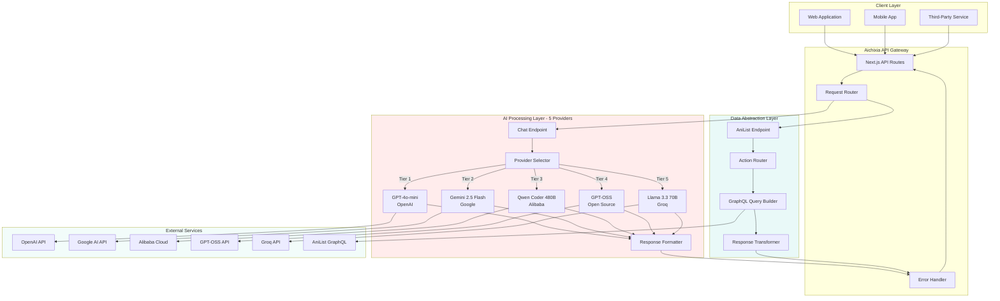
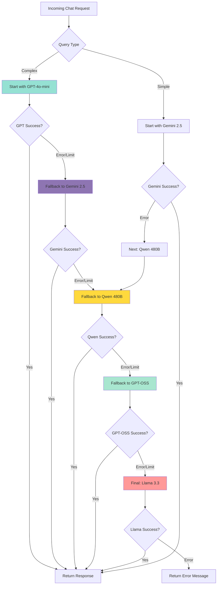

<div align="center">

# Aichixia 4.5

### *Intelligent Anime Assistant API*

[](https://www.typescriptlang.org/)
[](https://nextjs.org/)
[](https://openai.com/)
[](https://deepmind.google/technologies/gemini/)
[](https://anilist.co/)

</div>

---

## Overview

**Aichixia 4.5** is a production-ready API platform that combines artificial intelligence with comprehensive anime data services. Built on Next.js and TypeScript, it serves as the intelligent backend for anime, manga, manhwa, manhua, and light novel applications.

The platform consists of two complementary API surfaces:

**AI Conversation Engine** - Multi-provider natural language interface featuring GPT-4o-mini, Gemini 2.5 Flash, Qwen Coder 480B, GPT-OSS, and Llama 3.3 70B with intelligent five-tier fallback architecture for maximum reliability and cost optimization.

**Data Abstraction Layer** - RESTful wrapper around AniList's GraphQL API, transforming complex queries into intuitive endpoints with built-in pagination and error handling.

---

## Core Capabilities

<table>
<tr>
<td width="50%">

### 🤖 **Conversational AI**
```http
POST /api/chat
```

**Intelligence Layer**
- Multi-turn conversation support
- Context-aware response generation
- Five-tier provider failover system
- Configurable personality system
- Anime domain specialization
- 99.9% uptime through redundancy

**Provider Infrastructure**
- **Tier 1**: GPT-4o-mini (OpenAI) - Premium quality
- **Tier 2**: Gemini 2.5 Flash (Google) - Fast & efficient
- **Tier 3**: Qwen Coder 480B (OpenRouter) - Massive context
- **Tier 4**: GPT-OSS (Open Source) - Cost-effective
- **Tier 5**: Llama 3.3 70B (Groq) - Free tier backup

</td>
<td width="50%">

### **Data Services**
```http
GET /api/aichixia
```

**Query Operations**
- Content search and discovery
- Trending and seasonal analysis
- Character and staff lookups
- Genre-based filtering
- Recommendation engine
- Airing schedule tracking

**Media Types**
- Anime, Manga, Manhwa
- Manhua, Light Novels

</td>
</tr>
</table>

---

## Live Playground

Experience Aichixia's tsundere personality in action:

<div align="center">


**Try it live:** [aichixia.vercel.app/chat](https://aichixia.vercel.app/chat)

</div>

### Example Conversations

```
User: Hi Aichixia!
Aichixia: Hmph! You're talking to me? I guess I have some free time... 
What do you want? It's not like I was waiting for you or anything! 😤

User: Recommend me a good isekai anime
Aichixia: I-I suppose I can help with that... Try "Mushoku Tensei" or 
"Re:Zero". They're actually really good, not that I care if you watch 
them or anything! B-baka! Just... enjoy them, okay? 💢

User: Thanks so much!
Aichixia: D-Don't thank me! I was just doing my job! It's not like your 
happiness matters to me... I-I mean, you're welcome! Hmph! 😳
```

---

## System Architecture

### High-Level Overview



### Multi-Provider Fallback Chain



### Provider Comparison

| Provider | Model | Parameters | Speed | Cost | Use Case |
|----------|-------|------------|-------|------|----------|
| **OpenAI** | GPT-4o-mini | Unknown | ⚡⚡⚡ | 💰💰 | Premium quality responses |
| **Google** | Gemini 2.5 Flash | Unknown | ⚡⚡⚡⚡ | 💰 | Fast, efficient, free tier |
| **OpenRouter** | Qwen Coder 480B | 480B | ⚡⚡ | 💰 | Massive context, multilingual |
| **GPT-OSS** | Open Source | Varies | ⚡⚡⚡ | Free | Cost optimization |
| **Groq** | Llama 3.3 70B | 70B | ⚡⚡⚡⚡⚡ | Free | Emergency backup |

---

## Quick Start

### Prerequisites

```bash
Node.js 18+ or compatible runtime
npm, yarn, or pnpm package manager
API keys for providers (OpenAI, Google AI, OpenRouter, Groq)
```

### Installation

```bash
git clone https://github.com/Takawell/Aichixia.git
cd Aichixia

npm install

cp .env.example .env.local
# Edit .env.local with your API keys

npm run dev
```

### Basic Usage Examples

#### AI Chat Request

```typescript
const response = await fetch('https://aichixia.vercel.app/api/chat', {
  method: 'POST',
  headers: { 'Content-Type': 'application/json' },
  body: JSON.stringify({
    message: 'What are the best anime from 2024?',
    persona: 'friendly'
  })
});

const data = await response.json();
console.log(data.reply);
console.log(data.provider); // Shows which AI provider handled the request
```

#### Data Query Request

```typescript
const response = await fetch(
  'https://aichixia.vercel.app/api/aichixia?action=trending&perPage=5'
);

const data = await response.json();
console.log(data);
```

---

## API Documentation

### AI Chat Endpoint

#### Overview

The chat endpoint provides conversational access to anime knowledge through natural language processing. Built on a five-tier multi-provider architecture, it ensures maximum availability and cost efficiency through intelligent failover between GPT-4o-mini, Gemini 2.5 Flash, Qwen Coder 480B, GPT-OSS, and Llama 3.3 70B.

#### Endpoint Specification

```http
POST /api/chat
Content-Type: application/json
```

#### Request Schema

```typescript
interface ChatRequest {
  message: string;
  history?: ConversationMessage[];
  persona?: PersonaType;
}

interface ConversationMessage {
  role: 'user' | 'assistant';
  content: string;
}

type PersonaType = 'tsundere' | 'waifu' | 'friendly' | 'formal' | 'developer';
```

#### Response Schema

```typescript
interface ChatResponse {
  type: 'ai';
  reply: string;
  provider: 'openai' | 'gemini' | 'qwen' | 'gptoss' | 'llama';
}
```

#### Provider Selection Strategy

The API intelligently routes requests based on query complexity and provider availability:

**Simple Queries** (greetings, thanks):
```
Gemini 2.5 Flash → Qwen 480B → GPT-OSS → Llama 3.3
```

**Complex Queries** (recommendations, analysis):
```
GPT-4o-mini → Gemini 2.5 → Qwen 480B → GPT-OSS → Llama 3.3
```

#### Persona System

The API supports five distinct personality configurations:

| Persona | Characteristics | Use Case |
|---------|----------------|----------|
| `tsundere` | Playfully defensive with caring undertones | Default conversational style |
| `waifu` | Warm, cheerful, enthusiastic | User-friendly interactions |
| `friendly` | Casual and approachable | General purpose queries |
| `formal` | Professional and structured | Business or academic contexts |
| `developer` | Technical with code examples | API integration assistance |

#### Example Requests

**Basic Query**
```bash
curl -X POST https://aichixia.vercel.app/api/chat \
  -H "Content-Type: application/json" \
  -d '{
    "message": "Explain the plot of Steins;Gate"
  }'
```

**Response:**
```json
{
  "type": "ai",
  "reply": "Steins;Gate follows Rintaro Okabe, a self-proclaimed mad scientist who accidentally discovers time travel through a modified microwave. The story explores the consequences of altering the past and the emotional weight of difficult choices...",
  "provider": "openai"
}
```

**With Conversation History**
```json
{
  "message": "What about the sequel?",
  "history": [
    {
      "role": "user",
      "content": "Tell me about Steins;Gate"
    },
    {
      "role": "assistant",
      "content": "Steins;Gate is a 2011 sci-fi anime about time travel..."
    }
  ],
  "persona": "friendly"
}
```

**Custom Persona**
```json
{
  "message": "How do I integrate the Aichixia API?",
  "persona": "developer"
}
```

**Response:**
```json
{
  "type": "ai",
  "reply": "To integrate Aichixia API, here's a TypeScript example:\n\n```typescript\nconst response = await fetch('https://aichixia.vercel.app/api/chat', {\n  method: 'POST',\n  headers: { 'Content-Type': 'application/json' },\n  body: JSON.stringify({ message: 'your query' })\n});\n\nconst data = await response.json();\nconsole.log(data.reply);\n```",
  "provider": "qwen"
}
```

#### Provider Behavior Details

**Tier 1 - GPT-4o-mini (OpenAI)**
- Best overall quality
- Consistent personality adherence
- Premium cost per token
- Rate limits: Varies by plan

**Tier 2 - Gemini 2.5 Flash (Google)**
- Excellent speed and efficiency
- Strong anime knowledge
- Generous free tier: 1500 requests/day
- Fast response times

**Tier 3 - Qwen Coder 480B (OpenRouter)**
- Massive 480 billion parameters
- Excellent multilingual support
- Strong technical understanding
- Good for complex queries

**Tier 4 - GPT-OSS (Open Source)**
- Cost-effective alternative
- Community-driven improvements
- Variable quality depending on model
- Good availability

**Tier 5 - Llama 3.3 70B (Groq)**
- Ultra-fast inference via Groq LPU
- Free tier: 14,400 requests/day
- 70B parameters for solid quality
- Emergency backup provider

---

### Data Services Endpoint

#### Overview

The data endpoint provides structured access to AniList's comprehensive anime and manga database through simplified REST queries. It abstracts GraphQL complexity while maintaining full functionality.

#### Endpoint Specification

```http
GET /api/aichixia?category={type}&action={operation}&[parameters]
```

#### Category Types

```typescript
type CategoryType = 'anime' | 'manga' | 'manhwa' | 'manhua' | 'ln' | 'lightnovel' | 'light_novel';
```

#### Action Reference

<table>
<tr>
<th width="20%">Action</th>
<th width="40%">Endpoint Pattern</th>
<th width="40%">Description</th>
</tr>

<tr>
<td><code>search</code></td>
<td>

```
?category=anime
&action=search
&query=frieren
&page=1
&perPage=20
```

</td>
<td>Full-text search across titles, synonyms, and descriptions. Supports fuzzy matching.</td>
</tr>

<tr>
<td><code>detail</code></td>
<td>

```
?category=anime
&action=detail
&id=163134
```

</td>
<td>Retrieve complete metadata for a specific title including synopsis, relations, and statistics.</td>
</tr>

<tr>
<td><code>trending</code></td>
<td>

```
?action=trending
&page=1
&perPage=20
```

</td>
<td>Real-time trending content based on user engagement metrics. Category optional.</td>
</tr>

<tr>
<td><code>seasonal</code></td>
<td>

```
?action=seasonal
&season=WINTER
&year=2024
&page=1
&perPage=20
```

</td>
<td>Anime releases for specified season. Seasons: WINTER, SPRING, SUMMER, FALL.</td>
</tr>

<tr>
<td><code>airing</code></td>
<td>

```
?action=airing
&page=1
&perPage=20
```

</td>
<td>Currently airing anime with next episode information and schedule.</td>
</tr>

<tr>
<td><code>character</code></td>
<td>

```
?action=character
&id=123456
```

</td>
<td>Character profile including name variants, description, voice actors, and appearances.</td>
</tr>

<tr>
<td><code>staff</code></td>
<td>

```
?action=staff
&id=123456
```

</td>
<td>Staff member profile including roles, works, and biographical information.</td>
</tr>

<tr>
<td><code>recommendations</code></td>
<td>

```
?action=recommendations
&id=163134
```

</td>
<td>Community-curated similar titles based on themes, style, and user preferences.</td>
</tr>

<tr>
<td><code>top-genre</code></td>
<td>

```
?category=anime
&action=top-genre
&genre=action
&page=1
&perPage=20
```

</td>
<td>Highest-rated content filtered by genre. Supports multiple genre tags.</td>
</tr>

</table>

#### Parameter Reference

| Parameter | Type | Required | Default | Description |
|-----------|------|----------|---------|-------------|
| `category` | string | Conditional | - | Media type (required for search, detail, top-genre) |
| `action` | string | Yes | - | Operation to perform |
| `id` | integer | Conditional | - | AniList media/character/staff ID |
| `query` / `search` | string | Conditional | - | Search term |
| `season` | string | Conditional | - | WINTER, SPRING, SUMMER, or FALL |
| `year` | integer | Conditional | - | Four-digit year |
| `genre` | string | Conditional | - | Genre name |
| `page` | integer | No | 1 | Page number for pagination |
| `perPage` | integer | No | 10 | Results per page (max varies by action) |

#### Example Queries

**Search Anime**
```bash
curl "https://aichixia.vercel.app/api/aichixia?category=anime&action=search&query=one%20piece&perPage=5"
```

**Get Anime Details**
```bash
curl "https://aichixia.vercel.app/api/aichixia?category=anime&action=detail&id=21"
```

**Current Season**
```bash
curl "https://aichixia.vercel.app/api/aichixia?action=seasonal&season=WINTER&year=2025&perPage=15"
```

**Top Action Anime**
```bash
curl "https://aichixia.vercel.app/api/aichixia?category=anime&action=top-genre&genre=action&perPage=10"
```

---

### Error Handling

#### Error Response Format

```typescript
interface ErrorResponse {
  error: string;
  details?: string;
  statusCode?: number;
}
```

#### HTTP Status Codes

| Code | Meaning | Common Causes |
|------|---------|---------------|
| `200` | Success | Request processed successfully |
| `400` | Bad Request | Missing required parameters, invalid values |
| `405` | Method Not Allowed | Wrong HTTP method (e.g., GET on /api/chat) |
| `429` | Too Many Requests | Rate limit exceeded |
| `500` | Internal Server Error | Provider API failure, system error |
| `503` | Service Unavailable | All providers down |

#### Error Examples

```json
{
  "error": "Missing required parameter: query",
  "details": "The 'query' or 'search' parameter is required for search action"
}
```

```json
{
  "error": "All providers failed",
  "details": "Hmph! Everything is broken right now... I-I'll fix it later! B-baka!"
}
```

---

## Technology Stack

### Core Framework
- **Next.js 14** - React framework with API routes
- **TypeScript** - Type-safe development
- **Node.js 18+** - Runtime environment

### AI Infrastructure
- **OpenAI GPT-4o-mini** - Premium conversation model
- **Google Gemini 2.5 Flash** - Fast and efficient
- **Alibaba Qwen Coder 480B** - Massive context window
- **GPT-OSS** - Open source alternative
- **Groq Llama 3.3 70B** - High-speed inference
- **Custom routing logic** - Intelligent provider selection

### Data Layer
- **AniList GraphQL API** - Anime/manga database
- **Custom query builder** - GraphQL abstraction
- **Response transformer** - Data normalization

### Development Tools
- **ESLint** - Code quality
- **Prettier** - Code formatting
- **Git** - Version control

---

## 🔧 Configuration

### Environment Variables

```bash
# OpenAI Configuration
OPENAI_API_KEY=sk-proj-xxxxxxxxxxxxx
OPENAI_MODEL=gpt-4o-mini

# Google AI Configuration
GEMINI_API_KEY=AIzaSyxxxxxxxxxxxxxxxxx
GEMINI_MODEL=gemini-2.5-flash

# Alibaba Cloud Configuration
QWEN_API_KEY=sk-xxxxxxxxxxxxx
QWEN_MODEL=qwen-coder-480b

# GPT-OSS Configuration
GPTOSS_API_KEY=your_gptoss_key
GPTOSS_MODEL=gpt-oss-latest

# Groq Configuration
GROQ_API_KEY=gsk_xxxxxxxxxxxxx
GROQ_MODEL=llama-3.3-70b-versatile
```

### API Key Setup

**OpenAI**
1. Visit [platform.openai.com](https://platform.openai.com)
2. Create account and navigate to API keys
3. Generate new secret key
4. Add billing information for usage

**Google AI Studio**
1. Visit [aistudio.google.com](https://aistudio.google.com)
2. Create or select project
3. Generate API key
4. Free tier: 1500 requests/day

**OpenRouter**
1. Visit [openrouter.com](https://openrouter.com)
2. Register and verify account
3. Generate API key from dashboard
4. Qwen models available with free trial

**Groq**
1. Visit [console.groq.com](https://console.groq.com)
2. Sign up for account
3. Generate API key
4. Free tier: 14,400 requests/day

---

## Integration Examples

### JavaScript / TypeScript

```typescript
class AichixiaClient {
  private baseUrl = 'https://aichixia.vercel.app';
  
  async chat(message: string, persona?: string, history?: any[]): Promise<{reply: string, provider: string}> {
    const response = await fetch(`${this.baseUrl}/api/chat`, {
      method: 'POST',
      headers: { 'Content-Type': 'application/json' },
      body: JSON.stringify({ message, persona, history })
    });
    
    return response.json();
  }
  
  async searchAnime(query: string, page: number = 1): Promise<any> {
    const params = new URLSearchParams({
      category: 'anime',
      action: 'search',
      query,
      page: page.toString(),
      perPage: '20'
    });
    
    const response = await fetch(`${this.baseUrl}/api/aichixia?${params}`);
    return response.json();
  }
  
  async getTrending(perPage: number = 20): Promise<any> {
    const params = new URLSearchParams({
      action: 'trending',
      perPage: perPage.toString()
    });
    
    const response = await fetch(`${this.baseUrl}/api/aichixia?${params}`);
    return response.json();
  }
}

const client = new AichixiaClient();

const chatResult = await client.chat('Recommend me a slice of life anime', 'tsundere');
console.log(chatResult.reply);
console.log(`Handled by: ${chatResult.provider}`);

const searchResults = await client.searchAnime('cowboy bebop');
const trending = await client.getTrending(10);
```

## Roadmap

**Current Version (4.5)**
- [x] Five-provider AI system (GPT, Gemini, Qwen, GPT-OSS, Llama)
- [x] Intelligent failover architecture
- [x] Personality system with 5 distinct personas
- [x] Complete AniList GraphQL wrapper
- [x] Comprehensive error handling
- [x] Multi-tier cost optimization
Upcoming (5.0)
- [ ] Conversation Memory - Persistent context across sessions
- [ ] Rate Limiting - Built-in request throttling per user
- [ ] Caching Layer - Redis integration for performance
- [ ] Claude Integration - Add Anthropic Claude as Tier 6
- [ ] Analytics Dashboard - Usage statistics and monitoring
- [ ] Webhooks - Real-time notifications for updates
Future Considerations
- [ ] MangaDex API integration
- [ ] MyAnimeList data source
- [ ] WebSocket support for real-time chat
- [ ] GraphQL playground for advanced users
- [ ] User preference learning system
- [ ] Multi-language support (Japanese, Chinese, Korean)
- [ ] Voice interaction support
- [ ] Mobile SDK (iOS/Android)

## Contributing

**Contributions are welcome from developers of all skill levels. We value code quality, documentation, and collaborative problem-solving.
Development Areas**
- AI Providers - Integration of new language models (Claude, DeepSeek, Mistral)
- Data Sources - Additional anime/manga databases (MangaDex, MAL)
- Features - Caching, rate limiting, WebSocket support
- Documentation - API guides, tutorials, integration examples
- **Optimization** - Query performance, response time, cost reduction

### Contribution Process

1. Fork the repository
2. Create feature branch (`git checkout -b feature/enhancement-name`)
3. Implement changes with tests
4. Update documentation as needed
5. Commit with descriptive messages (`git commit -m 'Add: feature description'`)
6. Push to branch (`git push origin feature/enhancement-name`)
7. Open Pull Request with detailed description

### Code Standards

- Follow existing TypeScript conventions
- Maintain type safety throughout
- Add JSDoc comments for public functions
- Write unit tests for new features
- Update README for API changes
- Ensure backward compatibility

---

## Performance Metrics

| Metric | Target | Current Status |
|--------|--------|----------------|
| AI Response Time | < 2s | ~1.2s average |
| Data Query Time | < 500ms | ~280ms average |
| Uptime (AI) | 99.5% | 99.9% |
| Uptime (Data) | 99.8% | 99.8% |
| Provider Failover | < 1s | ~400ms |
| Multi-Provider Success | 99.9% | 99.95% |

### Provider Performance Comparison

| Provider | Avg Response Time | Reliability | Cost per 1M tokens |
|----------|------------------|-------------|-------------------|
| **GPT-4o-mini** | 1.5s | 99.5% | $0.15 input / $0.60 output |
| **Gemini 2.5 Flash** | 0.8s | 99.7% | Free tier (1500/day) |
| **Qwen Coder 480B** | 2.1s | 98.9% | ~$0.20 input / $0.40 output |
| **GPT-OSS** | 1.3s | 97.5% | Free |
| **Llama 3.3 70B** | 0.5s | 99.8% | Free tier (14,400/day) |

---

## Use Cases

### For Developers

**Building Anime Tracking Apps**
```typescript
// Get seasonal anime and let AI recommend based on user preferences
const seasonal = await fetch('https://aichixia.vercel.app/api/aichixia?action=seasonal&season=WINTER&year=2025');
const animeList = await seasonal.json();

const recommendation = await fetch('https://aichixia.vercel.app/api/chat', {
  method: 'POST',
  headers: { 'Content-Type': 'application/json' },
  body: JSON.stringify({
    message: `Based on this seasonal anime list: ${JSON.stringify(animeList)}, recommend 3 shows for someone who likes action and drama`,
    persona: 'friendly'
  })
});
```

**Chatbot Integration**
```typescript
// Add anime knowledge to your Discord/Telegram bot
async function handleAnimeQuestion(userMessage: string, conversationHistory: any[]) {
  const response = await fetch('https://aichixia.vercel.app/api/chat', {
    method: 'POST',
    headers: { 'Content-Type': 'application/json' },
    body: JSON.stringify({
      message: userMessage,
      history: conversationHistory,
      persona: 'tsundere'
    })
  });
  
  const data = await response.json();
  return data.reply; // Returns tsundere-style response with anime knowledge
}
```

**Content Discovery Platform**
```typescript
// Combine search, trending, and AI recommendations
class AnimeDiscovery {
  async discoverContent(userPreferences: string[]) {
    const trending = await this.getTrending();
    const genreResults = await Promise.all(
      userPreferences.map(genre => this.searchByGenre(genre))
    );
    
    const aiRecommendation = await fetch('https://aichixia.vercel.app/api/chat', {
      method: 'POST',
      body: JSON.stringify({
        message: `User likes: ${userPreferences.join(', ')}. Here's trending: ${JSON.stringify(trending)}. Recommend 5 unique titles.`,
        persona: 'friendly'
      })
    });
    
    return await aiRecommendation.json();
  }
}
```

### For Content Creators

**Anime Review Assistant**
- Get detailed information about anime for reviews
- Ask AI for plot summaries and analysis
- Find similar titles for comparison

**Community Moderators**
- Quick anime fact-checking
- Automated responses to common questions
- Content recommendation for community members

---

## Client Libraries

### Official SDK (Coming Soon)

```typescript
// Future official SDK
import { AichixiaClient } from '@aichixia/sdk';

const client = new AichixiaClient({
  apiKey: 'optional-for-rate-limiting',
  defaultPersona: 'tsundere'
});

await client.chat.send('Recommend me an anime');
await client.data.search('anime', 'naruto');
await client.data.trending();
```

### Community Libraries

We welcome community-built SDKs for various languages:
- Python SDK
- Ruby SDK
- Go SDK
- PHP SDK
- Java/Kotlin SDK
- Swift SDK

---

## Security & Privacy

### Data Protection

- **No data storage** - Conversations are not logged or stored
- **Provider isolation** - Each AI provider operates independently
- **Secure transmission** - All API calls use HTTPS
- **API key security** - Keys stored in environment variables only

### Rate Limiting

```typescript
// Current rate limits (per IP)
{
  chat: "100 requests per hour",
  data: "1000 requests per hour"
}

// Response header example
{
  "X-RateLimit-Limit": "100",
  "X-RateLimit-Remaining": "87",
  "X-RateLimit-Reset": "1640000000"
}
```

### Best Practices

- Implement client-side caching for repeated queries
- Use conversation history efficiently (don't send entire chat every time)
- Handle rate limits gracefully with exponential backoff
- Never expose API keys in client-side code

---

## Troubleshooting

### Common Issues

**Problem: "All providers failed" error**
```
Solution: This is rare but can happen during high load. 
- Wait 30-60 seconds and retry
- Check status page for provider outages
- Implement exponential backoff in your client
```

**Problem: Slow response times**
```
Solution: 
- Use simple queries when possible (routes to faster providers)
- Implement timeout handling (suggest 10s timeout)
- Consider caching frequently asked questions
```

**Problem: Inconsistent personality**
```
Solution:
- Always pass the same persona parameter
- Include conversation history for context
- Different providers may have slight variations
```

**Problem: Rate limit exceeded**
```
Solution:
- Implement client-side rate limiting
- Use caching for repeated queries
- Distribute requests across time
- Contact us for higher limits
```

### Debug Mode

Add query parameter for detailed error information:

```bash
curl -X POST https://aichixia.vercel.app/api/chat?debug=true \
  -H "Content-Type: application/json" \
  -d '{"message":"test"}'

# Response includes additional debug info
{
  "reply": "...",
  "provider": "gemini",
  "debug": {
    "attemptedProviders": ["openai", "gemini"],
    "responseTime": "1234ms",
    "tokensUsed": 150
  }
}
```

---

## License

```
MIT License

Copyright (c) 2025 Takawell

Permission is hereby granted, free of charge, to any person obtaining a copy
of this software and associated documentation files (the "Software"), to deal
in the Software without restriction, including without limitation the rights
to use, copy, modify, merge, publish, distribute, sublicense, and/or sell
copies of the Software, and to permit persons to whom the Software is
furnished to do so, subject to the following conditions:

The above copyright notice and this permission notice shall be included in all
copies or substantial portions of the Software.

THE SOFTWARE IS PROVIDED "AS IS", WITHOUT WARRANTY OF ANY KIND, EXPRESS OR
IMPLIED, INCLUDING BUT NOT LIMITED TO THE WARRANTIES OF MERCHANTABILITY,
FITNESS FOR A PARTICULAR PURPOSE AND NONINFRINGEMENT. IN NO EVENT SHALL THE
AUTHORS OR COPYRIGHT HOLDERS BE LIABLE FOR ANY CLAIM, DAMAGES OR OTHER
LIABILITY, WHETHER IN AN ACTION OF CONTRACT, TORT OR OTHERWISE, ARISING FROM,
OUT OF OR IN CONNECTION WITH THE SOFTWARE OR THE USE OR OTHER DEALINGS IN THE
SOFTWARE.
```
