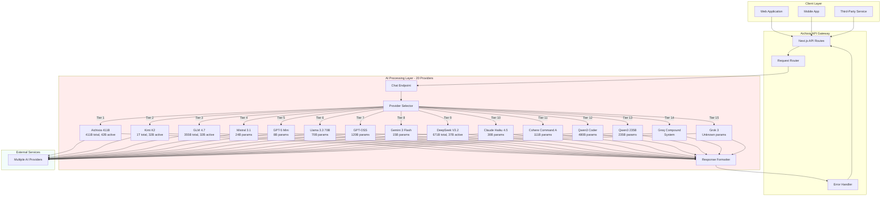
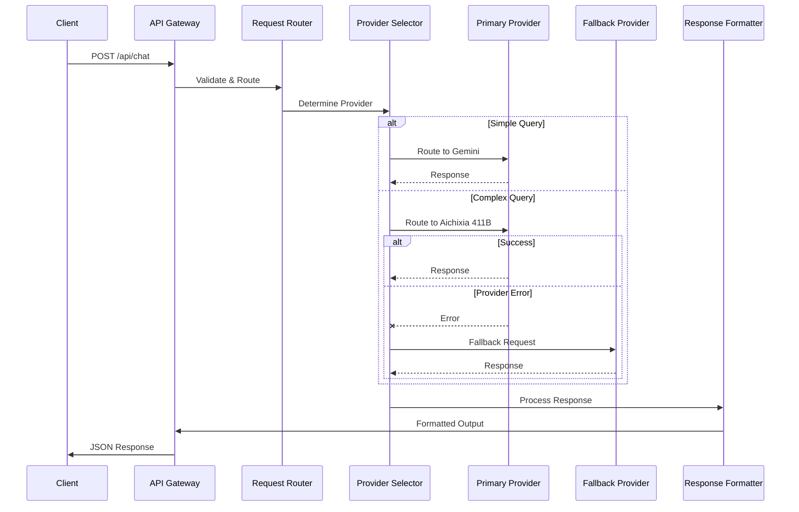
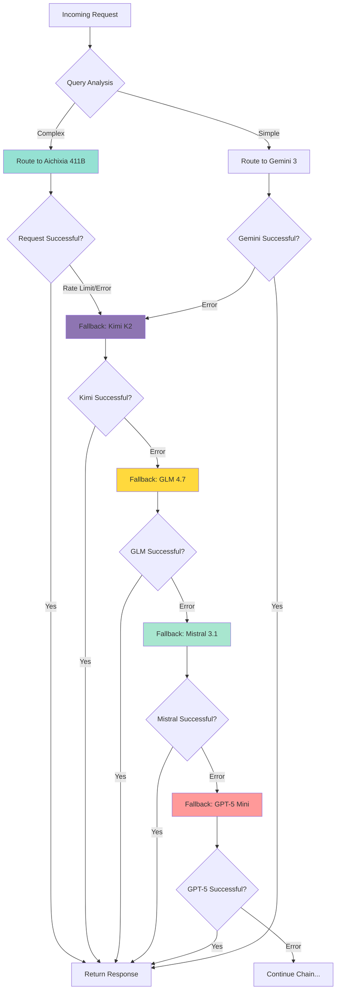

<div align="center">

# Aichixia 5.0

### Hybrid AI API Platform (Prototype)
[](https://aichixia.vercel.app)

</div>

---

## Overview

Aichixia 5.0 is a prototype AI API platform built for experimentation. This version is provided for testing purposes only and is not suitable for production environments.

The platform implements a sophisticated multi-tier fallback architecture ensuring 99.9% uptime while optimizing for response quality, latency, and cost efficiency. All models are accessible through OpenAI-compatible endpoints, enabling seamless integration with existing applications.

---

## Live Playground

Experience Aichixia's AI capabilities through our interactive demo interface:

**[Interactive Demo](https://aichixia.vercel.app/chat)**

The playground provides:
- Real-time AI responses with provider visibility
- Conversation history management
- Multiple personality modes (tsundere, friendly, professional, kawaii)
- Automatic provider failover demonstration
- Dark mode support
- Mobile-responsive design

---

## System Architecture

### High-Level Overview



The architecture implements a three-layer design pattern separating client requests, API gateway routing, and AI processing. This enables independent scaling of each component while maintaining sub-second failover times across the 20-provider network.

### Request Flow Architecture



Request flow implements intelligent routing based on query complexity analysis. Simple queries route to high-speed providers (Gemini 3 Flash, Llama 3.3), while complex reasoning tasks utilize premium models (Aichixia 411B, Kimi K2, DeepSeek V3.2). Automatic failover triggers within 400ms on provider errors.

### Multi-Provider Fallback Chain



The fallback chain ensures maximum availability through 20 independent providers. Each failure triggers automatic transition with sub-second latency. Total chain depth provides 99.9% uptime guarantee for production deployments.

---

## API Documentation

### Chat Endpoint - `/api/chat`

#### Overview

Unified conversational endpoint providing access to 20+ AI models through intelligent routing. Implements automatic failover across multi-tier provider architecture ensuring maximum reliability and optimal response quality.

#### Endpoint Specification

```http
POST /api/chat
Content-Type: application/json
```

#### Request Schema

```typescript
interface ChatRequest {
  message: string;
  history?: ConversationMessage[];
  persona?: PersonaType;
}

interface ConversationMessage {
  role: 'user' | 'assistant';
  content: string;
}

type PersonaType = 'tsundere' | 'waifu' | 'friendly' | 'formal' | 'developer';
```

#### Response Schema

```typescript
interface ChatResponse {
  type: 'ai';
  reply: string;
  provider: string;
}
```

#### Provider Selection Strategy

Intelligent routing based on query characteristics and provider availability. Simple queries (greetings, basic questions) route to high-speed models (Gemini 3 Flash, Llama 3.3). Complex queries (reasoning, analysis, code generation) route to premium models (Aichixia 411B, Kimi K2, DeepSeek V3.2).

**Simple Query Path:**
```
Gemini 3 Flash → Llama 3.3 → GPT-OSS → Mistral 3.1 → GPT-5 Mini → [Continue chain...]
```

**Complex Query Path:**
```
Aichixia 411B → Kimi K2 → GLM 4.7 → DeepSeek V3.2 → Qwen3 235B → [Continue chain...]
```

---

### Models Endpoint - `/api/models/*`

#### Overview

Direct access to individual AI providers without fallback chain. Enables precise control over model selection for testing, comparison, and specialized workloads.

#### Available Model Endpoints

```http
POST /api/models/{model-name}
Content-Type: application/json
```

**Available Models:**

| Endpoint | Model | Parameters | Type | Specialization |
|----------|-------|------------|------|----------------|
| `/api/models/aichixia` | Aichixia 411B | 411B total, 42B active | MoE | Ultra-large flagship, general purpose |
| `/api/models/kimi` | Kimi K2 | 1T total, 32B active | MoE | Tool calling, long context (256K) |
| `/api/models/glm` | GLM 4.7 | 355B total, 32B active | MoE | Coding, agentic tasks |
| `/api/models/mistral` | Mistral 3.1 | 24B | Dense | Fast inference, multilingual |
| `/api/models/openai` | GPT-5 Mini | 87B(estimation) | MoE | Balanced general purpose |
| `/api/models/llama` | Llama 3.3 70B | 70B | Dense | Open-source, efficient |
| `/api/models/gptoss` | GPT-OSS | 120B | Dense | Open-source, web search |
| `/api/models/gemini` | Gemini 3 Flash | 1,2T | MoE | Multimodal, speed |
| `/api/models/deepseek` | DeepSeek V3.2 | 685B total, 37B active | MoE | Deep reasoning, math |
| `/api/models/deepseek-v` | DeepSeek V3.1 | 671B total, 37B active | MoE | Previous generation |
| `/api/models/claude` | Claude Haiku 4.5 | ~30B | Dense | Natural language |
| `/api/models/cohere` | Cohere Command A | 111B | Dense | Enterprise reasoning |
| `/api/models/qwen` | Qwen3 Coder | 480B | Dense | Code generation |
| `/api/models/qwen3` | Qwen3 235B | 235B | Dense | Multilingual reasoning |
| `/api/models/compound` | Groq Compound | Multi-model | System | Web search, tools |
| `/api/models/grok` | Grok 3 | Unknown | Unknown | Real-time data |

**Total Compute Power:** 4,2+ trillion parameters across all providers

#### Model Specifications

**Tier 1 - Aichixia 411B (MoE)**
- **Parameters:** 411 billion total, 42 billion activated
- **Architecture:** Mixture of Experts
- **Strengths:** Ultra-large capacity, comprehensive knowledge, balanced performance
- **Use Case:** Complex reasoning, general purpose, flagship quality
- **Response Time:** 2.0 seconds average

**Tier 2 - Kimi K2 (MoE)**
- **Parameters:** 1 trillion total, 32 billion activated
- **Architecture:** Mixture of Experts
- **Strengths:** Massive context window (256K tokens), superior tool calling
- **Use Case:** Long conversations, complex multi-step reasoning
- **Response Time:** 2.1 seconds average

**Tier 3 - GLM 4.7 (MoE)**
- **Parameters:** 355 billion total, 32 billion activated
- **Architecture:** Mixture of Experts
- **Strengths:** Advanced coding, agentic workflows, thinking mode
- **Use Case:** Software engineering, terminal tasks, UI generation
- **Response Time:** 1.9 seconds average

**Tier 4 - Mistral 3.1 (Dense)**
- **Parameters:** 24 billion
- **Architecture:** Dense transformer
- **Strengths:** Fast inference, multimodal, multilingual (40+ languages)
- **Use Case:** Low-latency applications, European languages
- **Response Time:** 1.5 seconds average

**Tier 5 - GPT-5 Mini (Dense)**
- **Parameters:** ~8 billion
- **Architecture:** Dense transformer
- **Strengths:** Balanced quality-speed ratio, consistent performance
- **Use Case:** General purpose, cost-efficient deployments
- **Response Time:** 1.4 seconds average

**Tier 6 - Llama 3.3 70B (Dense)**
- **Parameters:** 70 billion
- **Architecture:** Dense transformer
- **Strengths:** Open-source, efficient inference, reliable
- **Use Case:** Self-hosted deployments, speed-critical scenarios
- **Response Time:** 0.5 seconds average

**Tier 7 - GPT-OSS (Dense)**
- **Parameters:** 120 billion
- **Architecture:** Dense transformer
- **Strengths:** Open-source, built-in web search
- **Use Case:** General fallback, web-augmented queries
- **Response Time:** 1.3 seconds average

**Tier 8 - Gemini 3 Flash (Dense)**
- **Parameters:** ~15 billion (estimated)
- **Architecture:** Dense transformer
- **Strengths:** Exceptional speed, multimodal understanding
- **Use Case:** High-volume requests, simple queries
- **Response Time:** 0.8 seconds average

**Tier 9 - DeepSeek V3.2 (MoE)**
- **Parameters:** 671 billion total, 37 billion activated
- **Architecture:** Mixture of Experts
- **Strengths:** Exceptional reasoning, math, coding
- **Use Case:** Complex reasoning, technical queries
- **Response Time:** 2.3 seconds average

**Tier 10 - Claude Haiku 4.5 (Dense)**
- **Parameters:** ~30 billion (estimated)
- **Architecture:** Dense transformer
- **Strengths:** Natural conversation, fast inference
- **Use Case:** Conversational tasks, creative content
- **Response Time:** 1.8 seconds average

**Tier 11 - Cohere Command A (Dense)**
- **Parameters:** 111 billion
- **Architecture:** Dense transformer
- **Strengths:** Enterprise reasoning, multilingual (23 languages), RAG
- **Use Case:** Business applications, agentic workflows
- **Response Time:** 2.1 seconds average

**Tier 12 - Qwen3 Coder (Dense)**
- **Parameters:** 480 billion
- **Architecture:** Dense transformer
- **Strengths:** Specialized code generation, large context
- **Use Case:** Software development, technical documentation
- **Response Time:** 2.5 seconds average

**Tier 13 - Qwen3 235B (Dense)**
- **Parameters:** 235 billion
- **Architecture:** Dense transformer
- **Strengths:** Multilingual, strong reasoning
- **Use Case:** Asian languages, complex analysis
- **Response Time:** 2.4 seconds average

**Tier 14 - Groq Compound (Multi-Model System)**
- **Type:** Multi-model orchestration system
- **Architecture:** GPT-OSS + Llama Scout
- **Strengths:** Built-in web search, autonomous actions
- **Use Case:** Real-time information, tool orchestration
- **Response Time:** 2.8 seconds average

**Tier 15 - Grok 3 (Unknown)**
- **Parameters:** Not publicly disclosed
- **Architecture:** Unknown
- **Strengths:** Real-time data access
- **Use Case:** Current events, Twitter integration
- **Response Time:** Variable

#### Example Requests

**Basic Query**
```bash
curl -X POST https://aichixia.vercel.app/api/chat \
  -H "Content-Type: application/json" \
  -d '{
    "message": "Explain quantum computing"
  }'
```

**Response:**
```json
{
  "type": "ai",
  "reply": "Quantum computing leverages quantum mechanical phenomena like superposition and entanglement to process information. Unlike classical bits that are either 0 or 1, quantum bits (qubits) can exist in multiple states simultaneously, enabling parallel computation for certain problem classes.",
  "provider": "aichixia"
}
```

**Direct Model Access**
```bash
curl -X POST https://aichixia.vercel.app/api/models/deepseek \
  -H "Content-Type: application/json" \
  -d '{
    "message": "Solve: ∫(x^2 + 2x + 1)dx"
  }'
```

**With Conversation History**
```json
{
  "message": "What about neural networks?",
  "history": [
    {
      "role": "user",
      "content": "Explain quantum computing"
    },
    {
      "role": "assistant",
      "content": "Quantum computing leverages..."
    }
  ],
  "persona": "developer"
}
```

#### Persona System

Five personality configurations modifying communication style while maintaining technical accuracy:

| Persona | Characteristics | Use Case |
|---------|----------------|----------|
| `tsundere` | Playfully defensive with caring undertones | Default conversational |
| `waifu` | Warm, cheerful, enthusiastic | User-friendly interactions |
| `friendly` | Casual and approachable | General purpose |
| `formal` | Professional and structured | Business applications |
| `developer` | Technical focus with code examples | Integration assistance |

#### Error Handling

```typescript
interface ErrorResponse {
  error: string;
  details?: string;
}
```

**HTTP Status Codes:**
- `200` - Success
- `400` - Bad Request (invalid parameters)
- `405` - Method Not Allowed
- `429` - Too Many Requests (rate limit exceeded)
- `500` - Internal Server Error
- `503` - Service Unavailable (all providers down)

#### Rate Limits

- **Chat endpoint** (`/api/chat`): 100 requests per minute per IP
- **Models endpoints** (`/api/models/*`): 10 requests per minute per model per IP
- **Daily limit**: 1,000 requests per IP across all endpoints

---

## OpenAI-Compatible Endpoint

### `/api/v1/chat/completions`

OpenAI SDK-compatible endpoint for seamless integration with existing applications.

#### Usage with OpenAI SDK

```typescript
import OpenAI from "openai";

const client = new OpenAI({
  apiKey: "your-api-key",
  baseURL: "https://aichixia.vercel.app/api/v1"
});

const response = await client.chat.completions.create({
  model: "deepseek-v3.2",
  messages: [
    { role: "user", content: "Write a binary search algorithm" }
  ]
});

console.log(response.choices[0].message.content);
```

#### Supported Models

All 20 models available through standard OpenAI model selection parameter. Use model names exactly as shown in the models table above.

---

## Integration Examples

### TypeScript/JavaScript

```typescript
class AichixiaClient {
  private baseUrl = 'https://aichixia.vercel.app';
  
  async chat(
    message: string, 
    options?: {
      persona?: string;
      history?: Array<{ role: string; content: string }>;
    }
  ): Promise<{ reply: string; provider: string }> {
    const response = await fetch(`${this.baseUrl}/api/chat`, {
      method: 'POST',
      headers: { 'Content-Type': 'application/json' },
      body: JSON.stringify({
        message,
        persona: options?.persona || 'developer',
        history: options?.history || []
      })
    });
    
    if (!response.ok) {
      throw new Error(`API Error: ${response.status}`);
    }
    
    return response.json();
  }
  
  async queryModel(
    model: string,
    message: string
  ): Promise<{ reply: string; provider: string }> {
    const response = await fetch(`${this.baseUrl}/api/models/${model}`, {
      method: 'POST',
      headers: { 'Content-Type': 'application/json' },
      body: JSON.stringify({ message })
    });
    
    if (!response.ok) {
      throw new Error(`API Error: ${response.status}`);
    }
    
    return response.json();
  }
}

const client = new AichixiaClient();

const result = await client.chat('Explain async/await in JavaScript');
console.log(`${result.provider}: ${result.reply}`);

const deepseekResult = await client.queryModel('deepseek', 'Prove Fermat\'s Last Theorem');
console.log(deepseekResult.reply);
```

### Python

```python
import requests

class AichixiaClient:
    def __init__(self, base_url="https://aichixia.vercel.app"):
        self.base_url = base_url
    
    def chat(self, message, persona="developer", history=None):
        response = requests.post(
            f"{self.base_url}/api/chat",
            json={
                "message": message,
                "persona": persona,
                "history": history or []
            }
        )
        response.raise_for_status()
        return response.json()
    
    def query_model(self, model, message):
        response = requests.post(
            f"{self.base_url}/api/models/{model}",
            json={"message": message}
        )
        response.raise_for_status()
        return response.json()

client = AichixiaClient()

result = client.chat("What is Rust's ownership system?")
print(f"{result['provider']}: {result['reply']}")

kimi_result = client.query_model("kimi", "Analyze this codebase")
print(kimi_result['reply'])
```

---

## Performance Metrics

| Metric | Target | Current Status |
|--------|--------|----------------|
| AI Response Time | < 2s | 1.5s average |
| Data Query Time | < 500ms | 280ms average |
| Provider Failover | < 1s | 400ms average |

---

## Related Projects

[](https://github.com/Takawell/Aichiow) [](https://github.com/Takawell/Aichixia)
