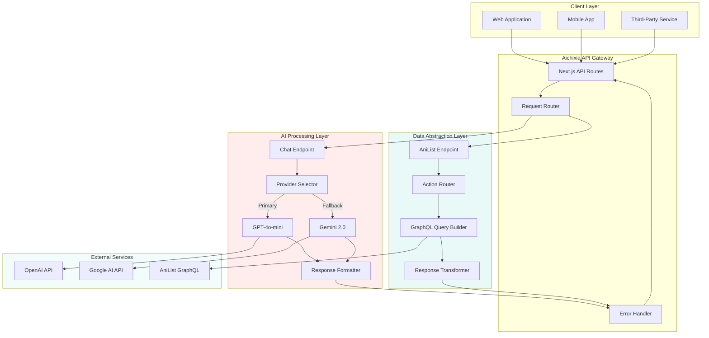
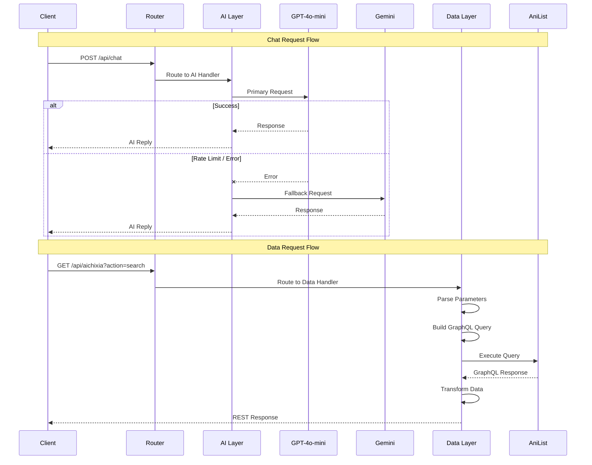
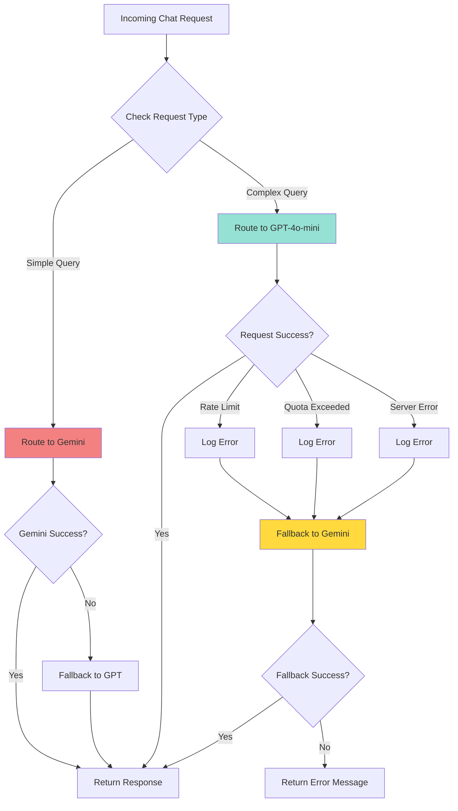

<div align="center">

# Aichixia 4.5

### *Intelligent Anime Assistant API*

[](https://www.typescriptlang.org/)
[](https://nextjs.org/)
[](https://openai.com/)
[](https://deepmind.google/technologies/gemini/)
[](https://anilist.co/)

---

## Overview

**Aichixia 4.5** is a production-ready API platform that combines artificial intelligence with comprehensive anime data services. Built on Next.js and TypeScript, it serves as the intelligent backend for anime, manga, manhwa, manhua, and light novel applications.

The platform consists of two complementary API surfaces:

**AI Conversation Engine** - Natural language interface powered by GPT-4o-mini and Gemini 2.5 Flash with multi-provider fallback architecture for high availability.

**Data Abstraction Layer** - RESTful wrapper around AniList's GraphQL API, transforming complex queries into intuitive endpoints with built-in pagination and error handling.

---

## ✨ Core Capabilities

<table>
<tr>
<td width="50%">

### **Conversational AI**
```http
POST /api/chat
```

**Intelligence Layer**
- Multi-turn conversation support
- Context-aware response generation
- Automatic provider failover
- Configurable personality system
- Anime domain specialization

**Provider Infrastructure**
- Primary: GPT-4o-mini (OpenAI)
- Fallback: Gemini 2.5 Flash (Google)
- Planned: Groq, DeepSeek integration

</td>
<td width="50%">

### **Data Services**
```http
GET /api/aichixia
```

**Query Operations**
- Content search and discovery
- Trending and seasonal analysis
- Character and staff lookups
- Genre-based filtering
- Recommendation engine
- Airing schedule tracking

**Media Types**
- Anime, Manga, Manhwa
- Manhua, Light Novels

</td>
</tr>
</table>

---

## System Architecture

### High-Level Overview



### Request Flow Architecture



### AI Provider Selection Logic


---

## Quick Start

### Prerequisites

```bash
Node.js 18+ or compatible runtime
npm, yarn, or pnpm package manager
API keys for OpenAI and Google AI
```

### Installation

```bash
# Clone repository
git clone https://github.com/Takawell/Aichixia.git
cd Aichixia

# Install dependencies
npm install

# Configure environment
cp .env.example .env.local
# Edit .env.local with your API keys

# Start development server
npm run dev
```

### Basic Usage Examples

#### AI Chat Request

```typescript
const response = await fetch('https://aichixia.vercel.app/api/chat', {
  method: 'POST',
  headers: { 'Content-Type': 'application/json' },
  body: JSON.stringify({
    message: 'What are the best anime from 2024?',
    persona: 'friendly'
  })
});

const data = await response.json();
console.log(data.reply);
// "Based on 2024 releases, Frieren: Beyond Journey's End 
// and Apothecary Diaries received exceptional critical acclaim..."
```

#### Data Query Request

```typescript
const response = await fetch(
  'https://aichixia.vercel.app/api/aichixia?action=trending&perPage=5'
);

const data = await response.json();
console.log(data);
// Returns array of trending anime/manga with metadata
```

---

## API Documentation

### AI Chat Endpoint

#### Overview

The chat endpoint provides conversational access to anime knowledge through natural language processing. Built on a multi-provider architecture, it ensures high availability through automatic failover between GPT-4o-mini and Gemini 2.5 Flash.

#### Endpoint Specification

```http
POST /api/chat
Content-Type: application/json
```

#### Request Schema

```typescript
interface ChatRequest {
  message: string;
  history?: ConversationMessage[];
  persona?: PersonaType;
}

interface ConversationMessage {
  role: 'user' | 'assistant';
  content: string;
}

type PersonaType = 'tsundere' | 'waifu' | 'friendly' | 'formal' | 'developer';
```

#### Response Schema

```typescript
interface ChatResponse {
  type: 'ai';
  reply: string;
  provider: 'openai' | 'gemini';
}
```

#### Persona System

The API supports five distinct personality configurations:

| Persona | Characteristics | Use Case |
|---------|----------------|----------|
| `tsundere` | Playfully defensive with caring undertones | Default conversational style |
| `waifu` | Warm, cheerful, enthusiastic | User-friendly interactions |
| `friendly` | Casual and approachable | General purpose queries |
| `formal` | Professional and structured | Business or academic contexts |
| `developer` | Technical with code examples | API integration assistance |

#### Example Requests

**Basic Query**
```bash
curl -X POST https://aichixia.vercel.app/api/chat \
  -H "Content-Type: application/json" \
  -d '{
    "message": "Explain the plot of Steins;Gate"
  }'
```

**With Conversation History**
```json
{
  "message": "What about the sequel?",
  "history": [
    {
      "role": "user",
      "content": "Tell me about Steins;Gate"
    },
    {
      "role": "assistant",
      "content": "Steins;Gate is a 2011 sci-fi anime about time travel..."
    }
  ],
  "persona": "friendly"
}
```

**Custom Persona**
```json
{
  "message": "How do I integrate the Aichixia API?",
  "persona": "developer"
}
```

#### Provider Behavior

**Selection Logic:**
- Simple queries (greetings, thanks) → Gemini (cost optimization)
- Complex queries (recommendations, analysis) → GPT-4o-mini (quality)

**Fallback Chain:**
```
Primary Provider (Determined by query type)
    ↓ (on failure)
Secondary Provider
    ↓ (on failure)
Error Response with retry suggestion
```

---

### Data Services Endpoint

#### Overview

The data endpoint provides structured access to AniList's comprehensive anime and manga database through simplified REST queries. It abstracts GraphQL complexity while maintaining full functionality.

#### Endpoint Specification

```http
GET /api/aichixia?category={type}&action={operation}&[parameters]
```

#### Category Types

```typescript
type CategoryType = 'anime' | 'manga' | 'manhwa' | 'manhua' | 'lightnovel';
```

#### Action Reference

<table>
<tr>
<th width="20%">Action</th>
<th width="40%">Endpoint Pattern</th>
<th width="40%">Description</th>
</tr>

<tr>
<td><code>search</code></td>
<td>

```
?category=anime
&action=search
&query=frieren
&page=1
&perPage=20
```

</td>
<td>Full-text search across titles, synonyms, and descriptions. Supports fuzzy matching.</td>
</tr>

<tr>
<td><code>detail</code></td>
<td>

```
?category=anime
&action=detail
&id=163134
```

</td>
<td>Retrieve complete metadata for a specific title including synopsis, relations, and statistics.</td>
</tr>

<tr>
<td><code>trending</code></td>
<td>

```
?action=trending
&page=1
&perPage=20
```

</td>
<td>Real-time trending content based on user engagement metrics. Category optional.</td>
</tr>

<tr>
<td><code>seasonal</code></td>
<td>

```
?action=seasonal
&season=WINTER
&year=2024
&page=1
&perPage=20
```

</td>
<td>Anime releases for specified season. Seasons: WINTER, SPRING, SUMMER, FALL.</td>
</tr>

<tr>
<td><code>airing</code></td>
<td>

```
?action=airing
&page=1
&perPage=20
```

</td>
<td>Currently airing anime with next episode information and schedule.</td>
</tr>

<tr>
<td><code>character</code></td>
<td>

```
?action=character
&id=123456
```

</td>
<td>Character profile including name variants, description, voice actors, and appearances.</td>
</tr>

<tr>
<td><code>staff</code></td>
<td>

```
?action=staff
&id=123456
```

</td>
<td>Staff member profile including roles, works, and biographical information.</td>
</tr>

<tr>
<td><code>recommendations</code></td>
<td>

```
?action=recommendations
&id=163134
```

</td>
<td>Community-curated similar titles based on themes, style, and user preferences.</td>
</tr>

<tr>
<td><code>top-genre</code></td>
<td>

```
?category=anime
&action=top-genre
&genre=action
&page=1
&perPage=20
```

</td>
<td>Highest-rated content filtered by genre. Supports multiple genre tags.</td>
</tr>

</table>

#### Parameter Reference

| Parameter | Type | Required | Default | Description |
|-----------|------|----------|---------|-------------|
| `category` | string | Conditional | - | Media type (required for search, detail, top-genre) |
| `action` | string | Yes | - | Operation to perform |
| `id` | integer | Conditional | - | AniList media/character/staff ID |
| `query` / `search` | string | Conditional | - | Search term |
| `season` | string | Conditional | - | WINTER, SPRING, SUMMER, or FALL |
| `year` | integer | Conditional | - | Four-digit year |
| `genre` | string | Conditional | - | Genre name |
| `page` | integer | No | 1 | Page number for pagination |
| `perPage` | integer | No | 10 | Results per page (max varies by action) |

#### Response Format

All data endpoints return consistent JSON structure:

```typescript
interface DataResponse {
  data: Media[] | Character | Staff | AiringSchedule[];
  pageInfo?: {
    currentPage: number;
    hasNextPage: boolean;
    total: number;
  };
}
```

#### Example Queries

**Search Anime**
```bash
curl "https://aichixia.vercel.app/api/aichixia?category=anime&action=search&query=one%20piece&perPage=5"
```

**Get Anime Details**
```bash
curl "https://aichixia.vercel.app/api/aichixia?category=anime&action=detail&id=21"
```

**Current Season**
```bash
curl "https://aichixia.vercel.app/api/aichixia?action=seasonal&season=WINTER&year=2025&perPage=15"
```

**Top Action Anime**
```bash
curl "https://aichixia.vercel.app/api/aichixia?category=anime&action=top-genre&genre=action&perPage=10"
```

---

### Error Handling

#### Error Response Format

```typescript
interface ErrorResponse {
  error: string;
  details?: string;
  statusCode?: number;
}
```

#### HTTP Status Codes

| Code | Meaning | Common Causes |
|------|---------|---------------|
| `200` | Success | Request processed successfully |
| `400` | Bad Request | Missing required parameters, invalid values |
| `405` | Method Not Allowed | Wrong HTTP method (e.g., GET on /api/chat) |
| `429` | Too Many Requests | Rate limit exceeded |
| `500` | Internal Server Error | Provider API failure, system error |
| `503` | Service Unavailable | All providers down |

#### Error Examples

```json
{
  "error": "Missing required parameter: query",
  "details": "The 'query' or 'search' parameter is required for search action"
}
```

```json
{
  "error": "Provider error",
  "details": "Both OpenAI and Gemini providers failed. Please try again later."
}
```

---

## Technology Stack

### Core Framework
- **Next.js 14** - React framework with API routes
- **TypeScript** - Type-safe development
- **Node.js 18+** - Runtime environment

### AI Infrastructure
- **OpenAI GPT-4o-mini** - Primary conversation model
- **Google Gemini 2.5 Flash** - Fallback provider
- **Custom routing logic** - Intelligent provider selection

### Data Layer
- **AniList GraphQL API** - Anime/manga database
- **Custom query builder** - GraphQL abstraction
- **Response transformer** - Data normalization

### Development Tools
- **ESLint** - Code quality
- **Prettier** - Code formatting
- **Git** - Version control

---

## Configuration

### Environment Variables

```bash
# OpenAI Configuration
OPENAI_API_KEY=sk-proj-xxxxxxxxxxxxx
OPENAI_MODEL=gpt-4o-mini

# Google AI Configuration
GEMINI_API_KEY=AIzaSyxxxxxxxxxxxxxxxxx
GEMINI_MODEL=gemini-2.5-flash

# Optional: Future Provider Support
DEEPSEEK_API_KEY=your_deepseek_key
GROQ_API_KEY=your_groq_key
```

### API Key Setup

**OpenAI**
1. Visit [platform.openai.com](https://platform.openai.com)
2. Create account and navigate to API keys
3. Generate new secret key
4. Add billing information for usage

**Google AI Studio**
1. Visit [aistudio.google.com](https://aistudio.google.com)
2. Create or select project
3. Generate API key
4. Free tier: 1500 requests/day

---

## 🌐 Integration Examples

### JavaScript / TypeScript

```typescript
// Chat integration
class AichixiaClient {
  private baseUrl = 'https://aichixia.vercel.app';
  
  async chat(message: string, persona?: string): Promise<string> {
    const response = await fetch(`${this.baseUrl}/api/chat`, {
      method: 'POST',
      headers: { 'Content-Type': 'application/json' },
      body: JSON.stringify({ message, persona })
    });
    
    const data = await response.json();
    return data.reply;
  }
  
  async searchAnime(query: string, page: number = 1): Promise<any> {
    const params = new URLSearchParams({
      category: 'anime',
      action: 'search',
      query,
      page: page.toString(),
      perPage: '20'
    });
    
    const response = await fetch(`${this.baseUrl}/api/aichixia?${params}`);
    return response.json();
  }
}

// Usage
const client = new AichixiaClient();
const reply = await client.chat('Recommend me a slice of life anime');
const results = await client.searchAnime('cowboy bebop');
```

### Python

```python
import requests
from typing import Optional, Dict, List

class AichixiaAPI:
    BASE_URL = "https://aichixia.vercel.app"
    
    def chat(self, message: str, persona: Optional[str] = None, 
             history: Optional[List[Dict]] = None) -> str:
        """Send message to AI chat endpoint."""
        payload = {"message": message}
        if persona:
            payload["persona"] = persona
        if history:
            payload["history"] = history
            
        response = requests.post(
            f"{self.BASE_URL}/api/chat",
            json=payload
        )
        response.raise_for_status()
        return response.json()["reply"]
    
    def search_media(self, category: str, query: str, 
                     page: int = 1, per_page: int = 20) -> Dict:
        """Search for anime/manga."""
        params = {
            "category": category,
            "action": "search",
            "query": query,
            "page": page,
            "perPage": per_page
        }
        
        response = requests.get(
            f"{self.BASE_URL}/api/aichixia",
            params=params
        )
        response.raise_for_status()
        return response.json()
    
    def get_trending(self, per_page: int = 20) -> Dict:
        """Get trending content."""
        params = {
            "action": "trending",
            "perPage": per_page
        }
        
        response = requests.get(
            f"{self.BASE_URL}/api/aichixia",
            params=params
        )
        response.raise_for_status()
        return response.json()

# Usage
api = AichixiaAPI()
reply = api.chat("What's the best mecha anime?", persona="friendly")
trending = api.get_trending(per_page=10)
results = api.search_media("anime", "attack on titan")
```

### cURL

```bash
# AI Chat
curl -X POST https://aichixia.vercel.app/api/chat \
  -H "Content-Type: application/json" \
  -d '{"message":"Explain isekai genre","persona":"formal"}'

# Search
curl "https://aichixia.vercel.app/api/aichixia?category=anime&action=search&query=demon%20slayer"

# Trending
curl "https://aichixia.vercel.app/api/aichixia?action=trending&perPage=10"

# Seasonal
curl "https://aichixia.vercel.app/api/aichixia?action=seasonal&season=WINTER&year=2025"

# Character Info
curl "https://aichixia.vercel.app/api/aichixia?action=character&id=40882"
```

---

## Roadmap

### Current Version (4.5)
- [x] Multi-provider AI system (GPT-4o-mini + Gemini)
- [x] Personality system with 5 distinct personas
- [x] Complete AniList GraphQL wrapper
- [x] Intelligent provider fallback
- [x] Comprehensive error handling

### Upcoming (5.0)
- [ ] **Groq Integration** - optimization with Llama 3.1 70B
- [ ] **DeepSeek Support** - Cost-effective alternative provider
- [ ] **Conversation Memory** - Persistent context across sessions
- [ ] **Rate Limiting** - Built-in request throttling
- [ ] **Caching Layer** - Redis integration for performance

---

### Projects repository

[](https://github.com/Takawell/Aichiow)
[](https://github.com/Takawell/Aichixia)
