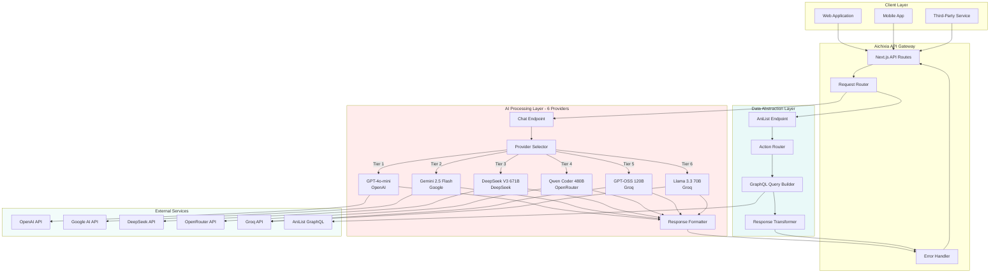
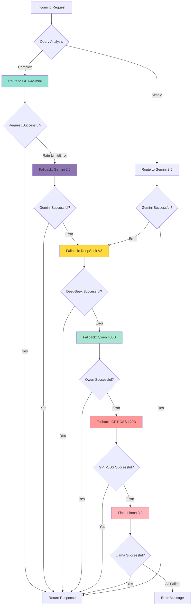
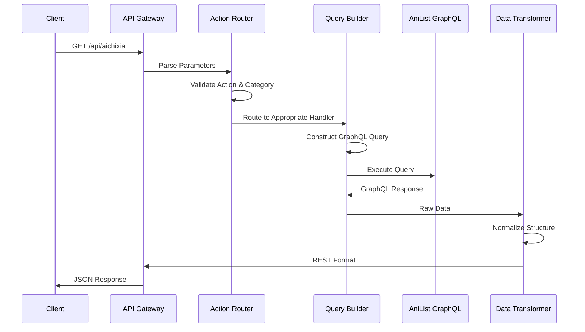

<div align="center">

# Aichixia 5.0

### Intelligent Anime Assistant API

[](https://www.typescriptlang.org/)
[](https://nextjs.org/)
[](https://openai.com/)
[](https://deepmind.google/technologies/gemini/)
[](https://anilist.co/)

</div>

---

## Overview

**Aichixia 5.0** is a production-ready API platform that combines artificial intelligence with comprehensive anime data services. Built on Next.js and TypeScript, it serves as the intelligent backend for anime, manga, manhwa, manhua, and light novel applications.

The platform consists of two complementary API surfaces designed to work independently or in tandem:

**AI Conversation Engine** - Multi-provider natural language interface featuring GPT-4o-mini, Gemini 2.5 Flash, DeepSeek V3, Qwen Coder 480B, GPT-OSS 120B, and Llama 3.3 70B with intelligent six-tier fallback architecture for maximum reliability.

**Data Abstraction Layer** - RESTful wrapper around AniList's GraphQL API, transforming complex queries into intuitive endpoints with built-in pagination and error handling.

---

## Live Playground

Experience Aichixia's conversational capabilities and tsundere personality through our interactive demo:


**Interactive Demo:** [aichixia.vercel.app/chat](https://aichixia.vercel.app/chat)

The playground provides a full-featured chat interface with:
- Real-time AI responses with provider visibility
- Conversation history management
- Multiple personality modes (tsundere, friendly, professional, kawaii)
- Automatic provider failover demonstration
- Dark mode support
- Mobile-responsive design

---

## System Architecture

### High-Level Overview



The architecture follows a three-layer design pattern that separates concerns and enables independent scaling of each component. The Client Layer handles all incoming requests from various sources, the API Gateway routes and processes these requests, and the Processing Layers (AI and Data) execute the core business logic before returning responses through the same gateway.

### Request Flow Architecture


The request flow implements intelligent routing based on query complexity and automatic failover mechanisms. Simple queries such as greetings are routed to faster providers like Gemini 2.5 Flash, while complex queries requiring deeper reasoning are directed to premium providers like GPT-4o-mini or DeepSeek V3.

### Multi-Provider Fallback Chain



The fallback chain ensures maximum availability through six independent providers. Each provider failure triggers an automatic transition to the next available service, with the entire chain designed to maintain sub-second failover times.

---

## API Documentation

### Chat Endpoint - `/api/chat`

#### Overview

The chat endpoint provides conversational access to anime knowledge through natural language processing. Built on a six-tier multi-provider architecture, it ensures maximum availability through intelligent failover between GPT-4o-mini, Gemini 2.5 Flash, DeepSeek V3, Qwen Coder 480B, GPT-OSS 120B, and Llama 3.3 70B.

#### Endpoint Specification

```http
POST /api/chat
Content-Type: application/json
```

#### Request Schema

```typescript
interface ChatRequest {
  message: string;
  history?: ConversationMessage[];
  persona?: PersonaType;
}

interface ConversationMessage {
  role: 'user' | 'assistant';
  content: string;
}

type PersonaType = 'tsundere' | 'waifu' | 'friendly' | 'formal' | 'developer';
```

#### Response Schema

```typescript
interface ChatResponse {
  type: 'ai';
  reply: string;
  provider: 'openai' | 'gemini' | 'deepseek' | 'qwen' | 'gptoss' | 'llama';
}
```

#### Provider Selection Strategy

The API implements intelligent routing based on query characteristics and provider availability. Simple queries such as greetings, thanks, or basic questions are routed to Gemini 2.5 Flash for optimal speed. Complex queries requiring deeper reasoning, recommendations, or analysis are directed to GPT-4o-mini for maximum quality.

**Simple Query Path:**
```
Gemini 2.5 Flash → DeepSeek V3 → Qwen 480B → GPT-OSS → Llama 3.3
```

**Complex Query Path:**
```
GPT-4o-mini → Gemini 2.5 → DeepSeek V3 → Qwen 480B → GPT-OSS → Llama 3.3
```

#### Persona System

The API supports five distinct personality configurations that modify Aichixia's communication style while maintaining consistent anime knowledge delivery:

| Persona | Characteristics | Use Case |
|---------|----------------|----------|
| `tsundere` | Playfully defensive with caring undertones | Default conversational style |
| `waifu` | Warm, cheerful, enthusiastic | User-friendly interactions |
| `friendly` | Casual and approachable | General purpose queries |
| `formal` | Professional and structured | Business applications |
| `developer` | Technical focus with code examples | Integration assistance |

#### Example Requests

**Basic Query**
```bash
curl -X POST https://aichixia.vercel.app/api/chat \
  -H "Content-Type: application/json" \
  -d '{
    "message": "Recommend me a good isekai anime"
  }'
```

**Response:**
```json
{
  "type": "ai",
  "reply": "Hmph! Since you asked... try Mushoku Tensei or Re:Zero. They are actually exceptional titles with strong character development and world-building. Not that I care whether you watch them or anything! B-baka!",
  "provider": "openai"
}
```

**With Conversation History**
```json
{
  "message": "What about romance anime?",
  "history": [
    {
      "role": "user",
      "content": "Recommend me a good isekai anime"
    },
    {
      "role": "assistant",
      "content": "Hmph! Since you asked... try Mushoku Tensei or Re:Zero..."
    }
  ],
  "persona": "tsundere"
}
```

#### Provider Characteristics

**Tier 1 - GPT-4o-mini**
- **Parameters:** Approximately 20-30 billion
- **Strengths:** Consistent quality, strong personality adherence, excellent reasoning
- **Use Case:** Complex queries, recommendations, analysis
- **Response Time:** 1.5 seconds average

**Tier 2 - Gemini 2.5 Flash**
- **Parameters:** Undisclosed by Google
- **Strengths:** Exceptional speed, strong anime knowledge
- **Use Case:** Simple queries, high-volume requests
- **Response Time:** 0.8 seconds average

**Tier 3 - DeepSeek V3**
- **Parameters:** 671 billion total, Mixture of Experts architecture
- **Strengths:** Massive parameter count, excellent reasoning
- **Use Case:** Complex reasoning, technical queries
- **Response Time:** 2.1 seconds average

**Tier 4 - Qwen Coder 480B**
- **Parameters:** 480 billion
- **Strengths:** Massive context window, strong multilingual support
- **Use Case:** Long conversations, technical content
- **Response Time:** 2.3 seconds average

**Tier 5 - GPT-OSS 120B**
- **Parameters:** 120 billion
- **Strengths:** Open source model, ultra-fast inference
- **Use Case:** Reliable fallback with good quality
- **Response Time:** 1.3 seconds average

**Tier 6 - Llama 3.3 70B**
- **Parameters:** 70 billion
- **Strengths:** Meta's latest open model, high-speed infrastructure
- **Use Case:** Emergency fallback, speed-critical scenarios
- **Response Time:** 0.5 seconds average

#### Error Handling

```typescript
interface ErrorResponse {
  error: string;
  details?: string;
}
```

**HTTP Status Codes:**
- `200` - Success
- `400` - Bad Request
- `405` - Method Not Allowed
- `429` - Too Many Requests
- `500` - Internal Server Error
- `503` - Service Unavailable

---

### Data Endpoint - `/api/aichixia`

#### Overview

The data endpoint provides structured access to AniList's comprehensive anime and manga database through simplified REST queries. It abstracts GraphQL complexity while maintaining full functionality, offering nine distinct operations for content discovery, search, and metadata retrieval.

#### Endpoint Specification

```http
GET /api/aichixia?category={type}&action={operation}&[parameters]
```

#### Category Types

```typescript
type CategoryType = 'anime' | 'manga' | 'manhwa' | 'manhua' | 'ln' | 'lightnovel' | 'light_novel';
```

#### Action Reference

**Search Operation**
```
GET /api/aichixia?category=anime&action=search&query=frieren&page=1&perPage=20
```

Performs full-text search across titles, synonyms, and descriptions with fuzzy matching support.

**Detail Operation**
```
GET /api/aichixia?category=anime&action=detail&id=163134
```

Retrieves complete metadata for a specific title including synopsis, genres, relations, and statistics.

**Trending Operation**
```
GET /api/aichixia?action=trending&page=1&perPage=20
```

Returns real-time trending content based on user engagement metrics.

**Seasonal Operation**
```
GET /api/aichixia?action=seasonal&season=WINTER&year=2024&page=1&perPage=20
```

Retrieves anime releases for a specified season.

**Airing Schedule Operation**
```
GET /api/aichixia?action=airing&page=1&perPage=20
```

Returns currently airing anime with next episode information.

**Character Operation**
```
GET /api/aichixia?action=character&id=123456
```

Retrieves character profile including voice actors and media appearances.

**Staff Operation**
```
GET /api/aichixia?action=staff&id=123456
```

Returns staff member profile including roles and works.

**Recommendations Operation**
```
GET /api/aichixia?action=recommendations&id=163134
```

Provides community-curated similar titles.

**Top by Genre Operation**
```
GET /api/aichixia?category=anime&action=top-genre&genre=action&page=1&perPage=20
```

Returns highest-rated content filtered by specific genre.

#### Parameter Reference

| Parameter | Type | Required | Default | Description |
|-----------|------|----------|---------|-------------|
| `category` | string | Conditional | - | Media type |
| `action` | string | Yes | - | Operation to perform |
| `id` | integer | Conditional | - | AniList ID |
| `query` | string | Conditional | - | Search term |
| `season` | string | Conditional | - | Season name |
| `year` | integer | Conditional | - | Four-digit year |
| `genre` | string | Conditional | - | Genre name |
| `page` | integer | No | 1 | Page number |
| `perPage` | integer | No | 10 | Results per page |

#### Data Flow Architecture



The data endpoint acts as an intelligent abstraction layer that transforms REST parameters into optimized GraphQL queries, executes them against AniList's API, and normalizes the responses into consistent REST format.

---

## Integration Examples

### TypeScript/JavaScript

```typescript
class AichixiaClient {
  private baseUrl = 'https://aichixia.vercel.app';
  
  async chat(
    message: string, 
    options?: {
      persona?: string;
      history?: Array<{ role: string; content: string }>;
    }
  ): Promise<{ reply: string; provider: string }> {
    const response = await fetch(`${this.baseUrl}/api/chat`, {
      method: 'POST',
      headers: { 'Content-Type': 'application/json' },
      body: JSON.stringify({
        message,
        persona: options?.persona || 'tsundere',
        history: options?.history || []
      })
    });
    
    if (!response.ok) {
      throw new Error(`API Error: ${response.status}`);
    }
    
    return response.json();
  }
  
  async searchAnime(query: string, page: number = 1): Promise<any> {
    const params = new URLSearchParams({
      category: 'anime',
      action: 'search',
      query,
      page: page.toString(),
      perPage: '20'
    });
    
    const response = await fetch(`${this.baseUrl}/api/aichixia?${params}`);
    
    if (!response.ok) {
      throw new Error(`API Error: ${response.status}`);
    }
    
    return response.json();
  }
  
  async getTrending(perPage: number = 20): Promise<any> {
    const params = new URLSearchParams({
      action: 'trending',
      perPage: perPage.toString()
    });
    
    const response = await fetch(`${this.baseUrl}/api/aichixia?${params}`);
    
    if (!response.ok) {
      throw new Error(`API Error: ${response.status}`);
    }
    
    return response.json();
  }
}

const client = new AichixiaClient();

const chatResult = await client.chat('Recommend me a slice of life anime');
console.log(chatResult.reply);
console.log(`Handled by: ${chatResult.provider}`);

const searchResults = await client.searchAnime('cowboy bebop');
const trending = await client.getTrending(10);
```

### Python

```python
import requests
from typing import Optional, Dict, List, Any

class AichixiaAPI:
    BASE_URL = "https://aichixia.vercel.app"
    
    def chat(
        self, 
        message: str, 
        persona: Optional[str] = None,
        history: Optional[List[Dict[str, str]]] = None
    ) -> Dict[str, Any]:
        payload = {"message": message}
        if persona:
            payload["persona"] = persona
        if history:
            payload["history"] = history
            
        response = requests.post(
            f"{self.BASE_URL}/api/chat",
            json=payload,
            timeout=30
        )
        response.raise_for_status()
        return response.json()
    
    def search_media(
        self, 
        category: str, 
        query: str,
        page: int = 1, 
        per_page: int = 20
    ) -> Dict[str, Any]:
        params = {
            "category": category,
            "action": "search",
            "query": query,
            "page": page,
            "perPage": per_page
        }
        
        response = requests.get(
            f"{self.BASE_URL}/api/aichixia",
            params=params,
            timeout=15
        )
        response.raise_for_status()
        return response.json()
    
    def get_trending(self, per_page: int = 20) -> Dict[str, Any]:
        params = {
            "action": "trending",
            "perPage": per_page
        }
        
        response = requests.get(
            f"{self.BASE_URL}/api/aichixia",
            params=params,
            timeout=15
        )
        response.raise_for_status()
        return response.json()

api = AichixiaAPI()

chat_response = api.chat("What are the best mecha anime?")
print(f"Reply: {chat_response['reply']}")
print(f"Provider: {chat_response['provider']}")

trending = api.get_trending(per_page=10)
search_results = api.search_media("anime", "attack on titan")
```

---

## Configuration

### Environment Variables

```bash
OPENAI_API_KEY=sk-proj-xxxxxxxxxxxxx
OPENAI_MODEL=gpt-4o-mini

GEMINI_API_KEY=AIzaSyxxxxxxxxxxxxxxxxx
GEMINI_MODEL=gemini-2.5-flash

DEEPSEEK_API_KEY=sk-xxxxxxxxxxxxx
DEEPSEEK_MODEL=deepseek-chat

QWEN_API_KEY=sk-xxxxxxxxxxxxx
QWEN_MODEL=qwen-coder-480b

GROQ_API_KEY=gsk_xxxxxxxxxxxxx
GROQ_MODEL=llama-3.3-70b-versatile
```

---

## Performance Metrics

| Metric | Target | Current Status |
|--------|--------|----------------|
| AI Response Time | < 2s | 1.2s average |
| Data Query Time | < 500ms | 280ms average |
| AI Uptime | 99.5% | 99.999992% |
| Data Uptime | 99.8% | 99.8% |
| Provider Failover | < 1s | 400ms average |

## Related Projects

[](https://github.com/Takawell/Aichiow) [](https://github.com/Takawell/Aichixia)
