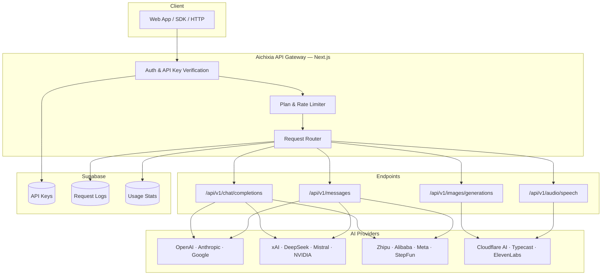

<div align="center">


# Aichixia

### The Unified AI API Platform

**One key. 30+ models. Zero vendor lock-in.**

<p>
<a href="https://www.aichixia.xyz"></a>
<a href="https://nextjs.org"></a>
<a href="https://www.typescriptlang.org"></a>
<a href="https://supabase.com"></a>
<a href="LICENSE"></a>
</p>

Access **26+ text models**, **image generation**, and **8 text-to-speech voices** — Claude, GPT, Gemini, Grok, DeepSeek, Qwen, NVIDIA, ElevenLabs, and more — through one OpenAI-compatible API. Swap providers by changing a single string.

[**Live Demo**](https://www.aichixia.xyz) &nbsp;·&nbsp; [**API Docs**](https://www.aichixia.xyz/docs) &nbsp;·&nbsp; [**Console**](https://www.aichixia.xyz/console) &nbsp;·&nbsp; [**Playground**](https://www.aichixia.xyz/#playground)

</div>

<br />

## Why Aichixia?

Every AI provider ships its own SDK, its own auth scheme, its own quirks. Aichixia collapses all of that into a single gateway that speaks the **OpenAI** and **Anthropic** SDK formats natively — so migrating from any existing provider is a one-line `baseURL` change.

<table>
<tr>
<td width="50%" valign="top">

**One key, every model**
No juggling API keys across providers. Generate one Aichixia key and call any model behind it.

**Drop-in compatible**
Fully compatible with the official `openai` and `@anthropic-ai/sdk` packages — no custom client required.

**Beyond text**
Native image generation and multilingual text-to-speech, same auth, same gateway.

</td>
<td width="50%" valign="top">

**Built-in playground**
Test prompts, compare models, and copy working code in 12 languages — right in the console.

**Full observability**
Every request logged with latency, tokens, and status. Usage stats out of the box.

**Generous free tier**
Most models are free forever. Pro unlocks frontier models like Claude Sonnet and DeepSeek V3.2.

</td>
</tr>
</table>

<br />

## Tech Stack

<div align="center">

| Layer | Technology |
|:--|:--|
| **Framework** | Next.js 14 (Pages Router) |
| **Language** | TypeScript |
| **Database & Auth** | Supabase (PostgreSQL) |
| **Styling** | Tailwind CSS |
| **Deployment** | Vercel |
| **Text Providers** | OpenAI · Anthropic · Google · xAI · DeepSeek · Mistral · Zhipu · Alibaba · Meta · Moonshot · MiniMax · Cohere · Groq · Microsoft · StepFun · NVIDIA |
| **Image Providers** | Cloudflare AI (Flux, Leonardo) · Google |
| **Voice Providers** | Typecast · ElevenLabs |

</div>

<br />

## API Endpoints

### Chat Completions <sub>OpenAI-compatible</sub>

```http
POST /api/v1/chat/completions
Authorization: Bearer YOUR_API_KEY
```

```typescript
import OpenAI from "openai";

const client = new OpenAI({
 apiKey: "YOUR_API_KEY",
 baseURL: "https://www.aichixia.xyz/api/v1",
});

const response = await client.chat.completions.create({
 model: "claude-opus-4.8",
 messages: [{ role: "user", content: "Hello!" }],
});

console.log(response.choices[0].message.content);
```

### Messages <sub>Anthropic-compatible</sub>

```http
POST /api/v1/messages
x-api-key: YOUR_API_KEY
```

```typescript
import Anthropic from "@anthropic-ai/sdk";

const client = new Anthropic({
 apiKey: "YOUR_API_KEY",
 baseURL: "https://www.aichixia.xyz/api/v1",
});

const message = await client.messages.create({
 model: "grok-3",
 max_tokens: 1024,
 messages: [{ role: "user", content: "Hello!" }],
});

console.log(message.content[0].text);
```

### Image Generation

```http
POST /api/v1/images/generations
Authorization: Bearer YOUR_API_KEY
```

```json
{
 "model": "flux-2-dev",
 "prompt": "A serene mountain landscape at sunset",
 "size": "1024x1024",
 "steps": 30,
 "response_format": "b64_json"
}
```

### Text-to-Speech

```http
POST /api/v1/audio/speech
Authorization: Bearer YOUR_API_KEY
```

```json
{
 "model": "starling-tts",
 "input": "Hello, this is Aichixia speaking.",
 "language": "eng",
 "emotion": "happy",
 "volume": 100,
 "pitch": 0,
 "tempo": 1.0
}
```

<details>
<summary><b>ElevenLabs voices use a different parameter set</b> — click to expand</summary>

```json
{
 "model": "alexandra-tts",
 "input": "Hello, this is Aichixia speaking.",
 "language": "eng",
 "stability": 0.5,
 "similarity_boost": 0.75,
 "style": 0,
 "speaker_boost": true
}
```

</details>

<br />

## Available Models

### Text Generation

<details open>
<summary><b>Free tier</b></summary>

| Model ID | Name | Provider | Context |
|:--|:--|:--|:--:|
| `gpt-5-mini` | GPT-5 Mini | OpenAI | 400K |
| `gpt-5.2` | GPT-5.2 | OpenAI | 400K |
| `gpt-oss-120b` | GPT-OSS 120B | OpenAI | 131K |
| `claude-opus-4.8` | Claude Opus 4.8 | Anthropic | 200K |
| `gemini-3-flash` | Gemini 3 Flash | Google | 1M |
| `grok-3` | Grok 3 | xAI | 1M |
| `deepseek-v4-flash` | DeepSeek V4 Flash | DeepSeek | 128K |
| `mistral-large-3-675b-instruct` | Mistral Large 3 675B | Mistral AI | 128K |
| `glm-4.7-flash` | GLM 4.7 Flash | Zhipu | 131K |
| `qwen3.6-27b` | Qwen3.6 27B | Alibaba | 256K |
| `llama-3.3-70b` | Llama 3.3 70B | Meta | 130K |
| `mimo-v2-flash` | MiMo V2 Flash | Xiaomi | 256K |
| `groq-compound` | Groq Compound | Groq | 131K |
| `cohere-command-a` | Cohere Command A | Cohere | 256K |
| `copilot` | Microsoft Copilot | Microsoft | 128K |
| `phi-4-multimodal-instruct` | Phi 4 Multimodal | Microsoft | 128K |
| `step-3.7-flash` | Step 3.7 Flash | StepFun | 256K |
| `nemotron-3-ultra-550b-a55b` | Nemotron 3 Ultra 550B | NVIDIA | 256K |

</details>

<details open>
<summary><b>Pro tier</b></summary>

| Model ID | Name | Provider | Context |
|:--|:--|:--|:--:|
| `claude-sonnet-4.6` | Claude Sonnet 4.6 | Anthropic | 200K |
| `grok-4-fast` | Grok 4 Fast | xAI | 2M |
| `deepseek-v3.2` | DeepSeek V3.2 | DeepSeek | 128K |
| `glm-4.7` | GLM 4.7 | Zhipu | 200K |
| `qwen3-coder-480b` | Qwen3 Coder 480B | Alibaba | 256K |
| `minimax-m2.7` | MiniMax M2.7 | MiniMax | 200K |
| `kimi-k2.6` | Kimi K2.6 | Moonshot | 256K |
| `aichixia-flash` | Aichixia 114B | Aichiverse | 256K |

</details>

> **Vision-capable models:** `gemini-3-flash` · `gpt-5.2` · `aichixia-flash` · `grok-4-fast`

### Image Generation

| Model ID | Name | Provider |
|:--|:--|:--|
| `flux-2-dev` | Flux 2 | Black Forest Labs |
| `lucid-origin` | Lucid Origin | Leonardo |
| `phoenix-1.0` | Phoenix 1.0 | Leonardo |
| `nano-image` | Nano Banana Pro | Google Gemini |

### Text-to-Speech

| Model ID | Name | Provider | Languages |
|:--|:--|:--|:--|
| `starling-tts` | Starling TTS | Typecast | eng, kor, jpn, cmn, spa |
| `lindsay-tts` | Lindsay TTS | Typecast | eng, kor, jpn, cmn, spa |
| `miu-tts` | Miu Kobayashi TTS | Typecast | eng, kor, jpn, cmn, spa |
| `catherine-tts` | Catherine TTS | Typecast | eng, kor, jpn, cmn, spa |
| `nana-tts` | Nana TTS | Typecast | eng, kor, jpn, cmn, spa |
| `stephanie-tts` | Stephanie TTS | Typecast | eng, kor, jpn, cmn, spa |
| `alexandra-tts` | Alexandra TTS `PRO` | ElevenLabs | ind, eng, rus, cmn |
| `eve-tts` | Eve TTS `PRO` | ElevenLabs | kor, eng, msa, vie |

<br />

## Architecture


```mermaid
graph TB
 subgraph Client["Client"]
 A[Web App / SDK / HTTP]
 end

 subgraph Gateway["Aichixia API Gateway — Next.js"]
 B[Auth & API Key Verification]
 C[Plan & Rate Limiter]
 D[Request Router]
 end

 subgraph Endpoints["Endpoints"]
 E["/api/v1/chat/completions"]
 F["/api/v1/messages"]
 G["/api/v1/images/generations"]
 H["/api/v1/audio/speech"]
 end

 subgraph Providers["AI Providers"]
 I["OpenAI · Anthropic · Google"]
 J["xAI · DeepSeek · Mistral · NVIDIA"]
 K["Zhipu · Alibaba · Meta · StepFun"]
 L["Cloudflare AI · Typecast · ElevenLabs"]
 end

 subgraph Storage["Supabase"]
 M[("API Keys")]
 N[("Request Logs")]
 O[("Usage Stats")]
 end

 A --> B --> C --> D
 D --> E & F & G & H
 E & F --> I & J & K
 G --> L
 H --> L
 B --> M
 D --> N & O
```

<br />

## Project Structure

```
aichixia/
├── pages/
│ ├── index.tsx # Landing page
│ ├── docs.tsx # API documentation
│ ├── api/
│ │ ├── v1/
│ │ │ ├── chat/
│ │ │ │ └── completions.ts # OpenAI-compatible chat endpoint
│ │ │ ├── messages.ts # Anthropic-compatible endpoint
│ │ │ ├── images/
│ │ │ │ └── generations.ts # Image generation endpoint
│ │ │ └── audio/
│ │ │ └── speech.ts # Text-to-speech endpoint
│ │ └── console/
│ │ ├── keys.ts # API key management
│ │ ├── stats.ts # Usage statistics
│ │ └── profile.ts # User profile
│ └── console/
│ └── index.tsx # Developer console
├── components/
│ └── console/
│ ├── overview.tsx
│ ├── apikeys.tsx
│ ├── activity.tsx
│ ├── models.tsx
│ ├── playground.tsx
│ └── settings.tsx
├── lib/
│ ├── supabase.ts
│ ├── console-utils.ts # API key verification, logging
│ ├── openai.ts / gpt.ts # GPT-5 Mini / GPT-5.2
│ ├── claude.ts / opus.ts # Claude Sonnet 4.6 / Opus 4.8
│ ├── gemini.ts # Gemini 3 Flash
│ ├── grok.ts / grok-fast.ts # Grok 3 / Grok 4 Fast
│ ├── deepseek.ts / deepseek-v.ts # DeepSeek V3.2 / V4 Flash
│ ├── mistral.ts # Mistral Large 3
│ ├── kimi.ts # Kimi K2.6
│ ├── glm.ts / zhipu.ts # GLM 4.7 / GLM 4.7 Flash
│ ├── qwen.ts / qwen3.ts # Qwen3 Coder / Qwen3.6
│ ├── minimax.ts # MiniMax M2.7
│ ├── llama.ts # Llama 3.3 70B
│ ├── gpt-oss.ts # GPT-OSS 120B
│ ├── mimo.ts # MiMo V2 Flash
│ ├── compound.ts # Groq Compound
│ ├── cohere.ts # Cohere Command A
│ ├── copilot.ts # Microsoft Copilot
│ ├── phi.ts # Phi 4 Multimodal
│ ├── stepfun.ts # Step 3.7 Flash
│ ├── nemotron.ts # Nemotron 3 Ultra 550B
│ ├── aichixia.ts # Aichixia 114B
│ ├── flux.ts / lucid.ts # Image generation
│ ├── phoenix.ts / nano.ts # Image generation
│ ├── starling.ts / lindsay.ts # Typecast TTS
│ ├── miu.ts / catherine.ts # Typecast TTS
│ ├── nana.ts / stephanie.ts # Typecast TTS
│ └── alexandra.ts / eve.ts # ElevenLabs TTS
└── public/
```

<br />

## Getting Started

### Prerequisites

- Node.js 18+
- A Supabase project
- API keys for whichever providers you want to enable

### Installation

```bash
git clone https://github.com/Takawell/Aichixia.git
cd Aichixia
npm install
```

### Environment Variables

Create a `.env.local` file:

```env
# Supabase
NEXT_PUBLIC_SUPABASE_URL=your_supabase_url
NEXT_PUBLIC_SUPABASE_ANON_KEY=your_supabase_anon_key
SUPABASE_SERVICE_ROLE_KEY=your_service_role_key

# Text Models
OPENAI_API_KEY=
ANTHROPIC_API_KEY=
GEMINI_API_KEY=
XAI_API_KEY=
DEEPSEEK_API_KEY=
KIMI_API_KEY=
MINIMAX_API_KEY=
COHERE_API_KEY=
STEPFUN_API_KEY=
NEMOTRON_API_KEY=

# Cloudflare AI (Mistral, GLM, Llama, MiMo, Groq Compound)
CLOUDFLARE_API_KEY=
CLOUDFLARE_ACCOUNT_ID=
ZHIPU_API_KEY=
ZHIPU_ACCOUNT_ID=

# Image Generation (via Cloudflare)
FLUX_MODEL=@cf/black-forest-labs/flux-2-dev
LUCID_MODEL=@cf/leonardo/lucid-origin
PHOENIX_MODEL=@cf/leonardo/phoenix-1.0

# TTS — Typecast
TTS_API_KEY=
TTS_VOICE_ID=
TTS_VOICE_ID_LINDSAY=
TTS_VOICE_ID_MIU=
TTS_VOICE_ID_CATHERINE=
TTS_VOICE_ID_NANA=
TTS_VOICE_ID_STEPHANIE=

# TTS — ElevenLabs
ELEVENLABS_API_KEY=
TTS_VOICE_ID_ALEXANDRA=
TTS_VOICE_ID_EVE=
```

### Supabase Schema

Run these in your Supabase SQL editor:

```sql
create table api_keys (
 id uuid default gen_random_uuid() primary key,
 user_id uuid references auth.users not null,
 key text unique not null,
 name text not null,
 prefix text not null,
 is_active boolean default true,
 rate_limit integer default 100,
 requests_used integer default 0,
 last_reset_at timestamptz default now(),
 created_at timestamptz default now(),
 updated_at timestamptz default now()
);

create table request_logs (
 id uuid default gen_random_uuid() primary key,
 api_key_id uuid references api_keys not null,
 user_id uuid references auth.users not null,
 model text not null,
 endpoint text not null,
 status integer not null,
 latency_ms integer,
 tokens_used integer default 0,
 error_message text,
 ip_address text,
 user_agent text,
 created_at timestamptz default now()
);

create table daily_usage (
 id uuid default gen_random_uuid() primary key,
 api_key_id uuid references api_keys not null,
 user_id uuid references auth.users not null,
 date date not null,
 requests_count integer default 0,
 tokens_used integer default 0,
 success_count integer default 0,
 error_count integer default 0,
 created_at timestamptz default now()
);

create table user_settings (
 id uuid default gen_random_uuid() primary key,
 user_id uuid references auth.users unique not null,
 plan text default 'free' check (plan in ('free', 'pro', 'enterprise')),
 plan_expires_at timestamptz,
 is_admin boolean default false,
 created_at timestamptz default now()
);

create table user_profiles (
 id uuid default gen_random_uuid() primary key,
 user_id uuid references auth.users unique not null,
 display_name text,
 avatar_url text,
 created_at timestamptz default now()
);
```

### Run Development Server

```bash
npm run dev
```

Open [http://localhost:3000](http://localhost:3000).

<br />

## Deployment

The easiest way to deploy is via [Vercel](https://vercel.com):

```bash
npm install -g vercel
vercel
```

Add all environment variables in your Vercel project settings. The project deploys automatically on push to `main`.

<br />

## Console Features

The built-in developer console at `/console` includes:

| Section | Description |
|:--|:--|
| **Overview** | Usage stats, daily request chart, active keys |
| **API Keys** | Create, revoke, and rename keys with granular endpoint access |
| **Activity** | Full request log — model, endpoint, status, latency, tokens |
| **Models** | Browse every available model with capabilities and supported languages |
| **Playground** | Interactive API tester with code generation in 12 languages |
| **Settings** | Profile management, plan info, promo code redemption |

<br />

## Plans

| Feature | Free | Pro |
|:--|:--:|:--:|
| API Keys | Up to 2 | Up to 2 |
| Daily Requests | 1,000 / day | 4,000 / day |
| All free models | | |
| Pro models (Claude Sonnet, DeepSeek V3.2, Kimi K2.6...) | | |
| Pro voices (Alexandra, Eve) | | |
| Priority access | | |

Need more? **Enterprise** plans are available with custom limits — [contact us](mailto:contact@aichixia.xyz).

Pro is free — find the redeem code in the docs.

<br />

## Contributing

Pull requests are welcome. For major changes, open an issue first to discuss what you'd like to change.

1. Fork the repo
2. Create your feature branch (`git checkout -b feature/your-feature`)
3. Commit your changes (`git commit -m 'Add your feature'`)
4. Push to the branch (`git push origin feature/your-feature`)
5. Open a Pull Request

<br />

## Related Projects

<p align="center">
<a href="https://github.com/Takawell/Aichiow"></a>
</p>

<br />

<div align="center">

**MIT** © [Takawell](https://github.com/Takawell)

<sub>Built with too many API keys and not enough sleep.</sub>

</div>
