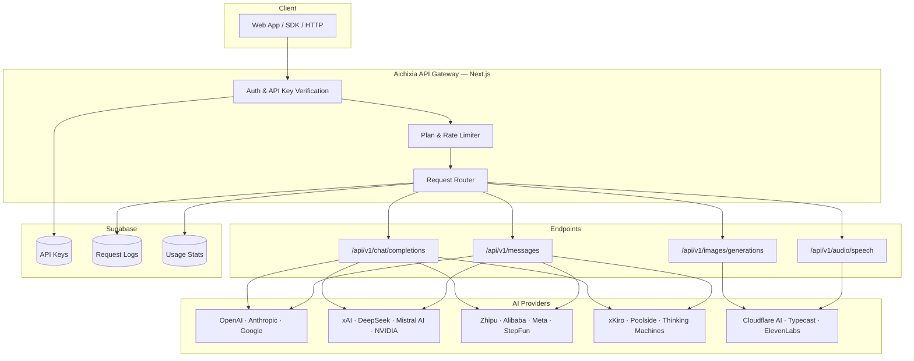

<div align="center">


# Aichixia

### The Unified AI API Platform

**One key. 30+ models. Zero vendor lock-in.**

<p>
<a href="https://www.aichixia.xyz"></a>
<a href="https://nextjs.org"></a>
<a href="https://www.typescriptlang.org"></a>
<a href="https://supabase.com"></a>
<a href="LICENSE"></a>
</p>

Access **30+ text models**, **image generation**, and **8 text-to-speech voices** — Claude, GPT, Gemini, Grok, DeepSeek, Mistral, Qwen, NVIDIA, ElevenLabs, and more — through one gateway that speaks both the **OpenAI** and **Anthropic** SDK formats natively.

[**Live Demo**](https://www.aichixia.xyz) &nbsp;·&nbsp; [**API Docs**](https://www.aichixia.xyz/docs) &nbsp;·&nbsp; [**Console**](https://www.aichixia.xyz/console) &nbsp;·&nbsp; [**Playground**](https://www.aichixia.xyz/#playground)

</div>

<br />

## Why Aichixia?

Every AI provider ships its own SDK, its own auth scheme, its own quirks. Aichixia collapses all of that into a single gateway that speaks the **OpenAI** and **Anthropic** SDK formats natively — so migrating from any existing provider is a one-line `baseURL` change.

<table>
<tr>
<td width="50%" valign="top">

**One key, every model**
No juggling API keys across providers. Generate one Aichixia key and call any model behind it.

**Drop-in compatible**
Fully compatible with the official `openai` and `@anthropic-ai/sdk` packages — no custom client required.

**Beyond text**
Native image generation and multilingual text-to-speech, same auth, same gateway.

</td>
<td width="50%" valign="top">

**Built-in playground**
Test prompts, compare models, and copy working code in 12 languages — right in the console.

**Full observability**
Every request logged with latency, tokens, and status. Usage stats out of the box.

**Generous free tier**
Most models are free forever. Pro and Enterprise unlock frontier models like Claude Opus and Claude Fable 5.

</td>
</tr>
</table>

<br />

## Tech Stack

<div align="center">

| Layer | Technology |
|:--|:--|
| **Framework** | Next.js 14 (Pages Router) |
| **Language** | TypeScript |
| **Database & Auth** | Supabase (PostgreSQL) |
| **Styling** | Tailwind CSS |
| **Deployment** | Vercel |
| **Text Providers** | OpenAI · Anthropic · Google · xAI · DeepSeek · Mistral AI · Zhipu · Alibaba · Meta · Moonshot · MiniMax · Cohere · Groq · Microsoft · StepFun · NVIDIA · Poolside · Thinking Machines |
| **Aggregator Gateways** | xKiro (multi-model relay) |
| **Image Providers** | Cloudflare AI (Flux, Leonardo) · Google |
| **Voice Providers** | Typecast · ElevenLabs |

</div>

<br />

## API Endpoints

### Chat Completions <sub>OpenAI-compatible</sub>

```http
POST /api/v1/chat/completions
Authorization: Bearer YOUR_API_KEY
```

```typescript
import OpenAI from "openai";

const client = new OpenAI({
  apiKey: "YOUR_API_KEY",
  baseURL: "https://www.aichixia.xyz/api/v1",
});

const response = await client.chat.completions.create({
  model: "claude-opus-4.8",
  messages: [{ role: "user", content: "Hello!" }],
});

console.log(response.choices[0].message.content);
```

### Messages <sub>Anthropic-compatible</sub>

```http
POST /api/v1/messages
x-api-key: YOUR_API_KEY
```

```typescript
import Anthropic from "@anthropic-ai/sdk";

const client = new Anthropic({
  apiKey: "YOUR_API_KEY",
  baseURL: "https://www.aichixia.xyz/api/v1",
});

const message = await client.messages.create({
  model: "claude-fable-5",
  max_tokens: 1024,
  messages: [{ role: "user", content: "Hello!" }],
});

console.log(message.content[0].text);
```

### Image Generation

```http
POST /api/v1/images/generations
Authorization: Bearer YOUR_API_KEY
```

```json
{
  "model": "flux-2-dev",
  "prompt": "A serene mountain landscape at sunset",
  "size": "1024x1024",
  "steps": 30,
  "response_format": "b64_json"
}
```

### Text-to-Speech

```http
POST /api/v1/audio/speech
Authorization: Bearer YOUR_API_KEY
```

```json
{
  "model": "starling-tts",
  "input": "Hello, this is Aichixia speaking.",
  "language": "eng",
  "emotion": "happy",
  "volume": 100,
  "pitch": 0,
  "tempo": 1.0
}
```

<details>
<summary><b>ElevenLabs voices use a different parameter set</b> — click to expand</summary>

```json
{
  "model": "alexandra-tts",
  "input": "Hello, this is Aichixia speaking.",
  "language": "eng",
  "stability": 0.5,
  "similarity_boost": 0.75,
  "style": 0,
  "speaker_boost": true
}
```

</details>

<br />

## Available Models

### Text Generation

<details open>
<summary><b>Free tier</b></summary>

| Model ID | Name | Provider | Context |
|:--|:--|:--|:--:|
| `gpt-5-mini` | GPT-5 Mini | OpenAI | 400K |
| `gpt-5.2` | GPT-5.2 | OpenAI | 400K |
| `gpt-oss-120b` | GPT-OSS 120B | OpenAI | 131K |
| `claude-haiku-4.5` | Claude Haiku 4.5 | Anthropic | 200K |
| `gemini-3-flash` | Gemini 3 Flash | Google | 1M |
| `grok-3` | Grok 3 | xAI | 1M |
| `deepseek-v4-flash` | DeepSeek V4 Flash | DeepSeek | 128K |
| `mistral-large-latest` | Mistral Large | Mistral AI | 256K |
| `glm-4.7-flash` | GLM 4.7 Flash | Zhipu | 131K |
| `qwen3.6-27b` | Qwen3.6 27B | Alibaba | 256K |
| `qwen3-coder-plus` | Qwen3 Coder Plus | Alibaba | 256K |
| `minimax-m3` | MiniMax M3 | MiniMax | 204K |
| `llama-3.3-70b` | Llama 3.3 70B | Meta | 130K |
| `groq-compound` | Groq Compound | Groq | 131K |
| `cohere-command-a` | Cohere Command A | Cohere | 256K |
| `phi-4-multimodal-instruct` | Phi 4 Multimodal | Microsoft | 128K |
| `step-3.7-flash` | Step 3.7 Flash | StepFun | 256K |
| `nemotron-3-ultra-550b-a55b` | Nemotron 3 Ultra 550B | NVIDIA | 256K |

</details>

<details open>
<summary><b>Pro tier</b></summary>

| Model ID | Name | Provider | Context |
|:--|:--|:--|:--:|
| `claude-sonnet-4.6` | Claude Sonnet 4.6 | Anthropic | 200K |
| `claude-opus-4.8` | Claude Opus 4.8 | Anthropic | 1M |
| `grok-4-fast` | Grok 4 Fast | xAI | 2M |
| `deepseek-v3.2` | DeepSeek V3.2 | DeepSeek | 128K |
| `glm-5.2` | GLM 5.2 | Zhipu | 200K |
| `kimi-k2.6` | Kimi K2.6 | Moonshot | 256K |
| `gpt-5.5` | GPT-5.5 | OpenAI | 400K |
| `mimo-v2.5-pro` | MiMo V2.5 Pro | Xiaomi | 256K |
| `laguna-s-2.1` | Laguna S 2.1 | Poolside | 256K |
| `thinkingmachines/inkling` | Inkling | Thinking Machines | 256K |
| `aichixia-flash` | Aichixia 114B | Aichiverse | 256K |

</details>

<details open>
<summary><b>Enterprise tier</b></summary>

| Model ID | Name | Provider | Context |
|:--|:--|:--|:--:|
| `claude-fable-5` | Claude Fable 5 | Anthropic | 1M |

</details>

> **Vision-capable models:** `gpt-5.2` · `kimi-k2.6` · `gemini-3-flash` · `grok-4-fast` · `phi-4-multimodal-instruct` · `qwen3.6-27b` · `step-3.7-flash` · `claude-fable-5` · `thinkingmachines/inkling`
>
> **Streaming-capable models:** `kimi-k2.6` · `mistral-large-latest` · `minimax-m3` · `step-3.7-flash` · `nemotron-3-ultra-550b-a55b` · `gpt-oss-120b` · `deepseek-v4-flash` · `glm-5.2` · `gemma-4-31b` · `laguna-s-2.1` · `cohere-command-a` · `gemini-3-flash` · `llama-3.3-70b` · `deepseek-v3.2` · `claude-fable-5` · `mimo-v2.5-pro` · `qwen3-coder-plus` · `thinkingmachines/inkling`

### Image Generation

| Model ID | Name | Provider |
|:--|:--|:--|
| `flux-2-dev` | Flux 2 | Black Forest Labs |
| `lucid-origin` | Lucid Origin | Leonardo |
| `phoenix-1.0` | Phoenix 1.0 | Leonardo |
| `nano-image` | Nano Banana Pro | Google Gemini |

### Text-to-Speech

| Model ID | Name | Provider | Languages |
|:--|:--|:--|:--|
| `starling-tts` | Starling TTS | Typecast | eng, kor, jpn, cmn, spa |
| `lindsay-tts` | Lindsay TTS | Typecast | eng, kor, jpn, cmn, spa |
| `miu-tts` | Miu Kobayashi TTS | Typecast | eng, kor, jpn, cmn, spa |
| `catherine-tts` | Catherine TTS | Typecast | eng, kor, jpn, cmn, spa |
| `nana-tts` | Nana TTS | Typecast | eng, kor, jpn, cmn, spa |
| `stephanie-tts` | Stephanie TTS | Typecast | eng, kor, jpn, cmn, spa |
| `alexandra-tts` | Alexandra TTS `PRO` | ElevenLabs | ind, eng, rus, cmn |
| `eve-tts` | Eve TTS `PRO` | ElevenLabs | kor, eng, msa, vie |

<br />

## Architecture


```mermaid
graph TB
  subgraph Client["Client"]
  A[Web App / SDK / HTTP]
  end

  subgraph Gateway["Aichixia API Gateway — Next.js"]
  B[Auth & API Key Verification]
  C[Plan & Rate Limiter]
  D[Request Router]
  end

  subgraph Endpoints["Endpoints"]
  E["/api/v1/chat/completions"]
  F["/api/v1/messages"]
  G["/api/v1/images/generations"]
  H["/api/v1/audio/speech"]
  end

  subgraph Providers["AI Providers"]
  I["OpenAI · Anthropic · Google"]
  J["xAI · DeepSeek · Mistral AI · NVIDIA"]
  K["Zhipu · Alibaba · Meta · StepFun"]
  L["xKiro · Poolside · Thinking Machines"]
  M["Cloudflare AI · Typecast · ElevenLabs"]
  end

  subgraph Storage["Supabase"]
  N[("API Keys")]
  O[("Request Logs")]
  P[("Usage Stats")]
  end

  A --> B --> C --> D
  D --> E & F & G & H
  E & F --> I & J & K & L
  G --> M
  H --> M
  B --> N
  D --> O & P
```

<br />

## Project Structure

```
aichixia/
├── pages/
│ ├── index.tsx                     # Landing page
│ ├── docs.tsx                      # API documentation
│ ├── api/
│ │ ├── v1/
│ │ │ ├── chat/
│ │ │ │ └── completions.ts          # OpenAI-compatible chat endpoint
│ │ │ ├── messages.ts               # Anthropic-compatible endpoint
│ │ │ ├── images/
│ │ │ │ └── generations.ts          # Image generation endpoint
│ │ │ └── audio/
│ │ │   └── speech.ts               # Text-to-speech endpoint
│ │ └── console/
│ │   ├── keys.ts                   # API key management
│ │   ├── stats.ts                  # Usage statistics
│ │   └── profile.ts                # User profile
│ └── console/
│   └── index.tsx                   # Developer console
├── components/
│ └── console/
│   ├── overview.tsx
│   ├── apikeys.tsx
│   ├── activity.tsx
│   ├── models.tsx
│   ├── playground.tsx
│   └── settings.tsx
├── lib/
│ ├── supabase.ts
│ ├── console-utils.ts              # API key verification, logging
│ ├── openai.ts / gpt.ts            # GPT-5 Mini / GPT-5.2
│ ├── gpt-5-5.ts                    # GPT-5.5
│ ├── claude.ts / opus.ts           # Claude Sonnet 4.6 / Opus 4.8
│ ├── haiku.ts                      # Claude Haiku 4.5
│ ├── fable.ts                      # Claude Fable 5 (via xKiro)
│ ├── gemini.ts                     # Gemini 3 Flash
│ ├── grok.ts / grok-fast.ts        # Grok 3 / Grok 4 Fast
│ ├── deepseek.ts / deepseek-v.ts   # DeepSeek V3.2 / V4 Flash
│ ├── mistral.ts                    # Mistral Large (official API)
│ ├── kimi.ts                       # Kimi K2.6
│ ├── glm.ts / zhipu.ts             # GLM 5.2 / GLM 4.7 Flash
│ ├── qwen.ts / qwen3.ts            # Qwen3 Coder Plus / Qwen3.6 (via xKiro)
│ ├── minimax.ts                    # MiniMax M3
│ ├── llama.ts                      # Llama 3.3 70B
│ ├── gpt-oss.ts                    # GPT-OSS 120B
│ ├── mimo.ts                       # MiMo V2.5 Pro (via xKiro)
│ ├── laguna.ts                     # Laguna S 2.1 (Poolside)
│ ├── inkling.ts                    # Inkling (Thinking Machines, via NVIDIA)
│ ├── compound.ts                   # Groq Compound
│ ├── cohere.ts                     # Cohere Command A
│ ├── phi.ts                        # Phi 4 Multimodal
│ ├── stepfun.ts                    # Step 3.7 Flash
│ ├── nemotron.ts                   # Nemotron 3 Ultra 550B
│ ├── gemma.ts                      # Gemma 4 31B
│ ├── aichixia.ts                   # Aichixia 114B
│ ├── flux.ts / lucid.ts            # Image generation
│ ├── phoenix.ts / nano.ts          # Image generation
│ ├── starling.ts / lindsay.ts      # Typecast TTS
│ ├── miu.ts / catherine.ts         # Typecast TTS
│ ├── nana.ts / stephanie.ts        # Typecast TTS
│ └── alexandra.ts / eve.ts         # ElevenLabs TTS
└── public/
```

<br />

## Getting Started

### Prerequisites

- Node.js 18+
- A Supabase project
- API keys for whichever providers you want to enable

### Installation

```bash
git clone https://github.com/Takawell/Aichixia.git
cd Aichixia
npm install
```

### Environment Variables

Create a `.env.local` file:

```env
# Supabase
NEXT_PUBLIC_SUPABASE_URL=your_supabase_url
NEXT_PUBLIC_SUPABASE_ANON_KEY=your_supabase_anon_key
SUPABASE_SERVICE_ROLE_KEY=your_service_role_key

# Text Models — direct providers
OPENAI_API_KEY=
ANTHROPIC_API_KEY=
GEMINI_API_KEY=
XAI_API_KEY=
DEEPSEEK_API_KEY=
MISTRAL_API_KEY=
KIMI_API_KEY=
MINIMAX_API_KEY=
COHERE_API_KEY=
STEPFUN_API_KEY=
NVIDIA_API_KEY=

# Text Models — via xKiro gateway (Claude Fable 5, Qwen3 Coder Plus, MiMo V2.5 Pro)
XKIRO_API_KEY=

# Cloudflare AI (GLM, Llama, Groq Compound)
CLOUDFLARE_API_KEY=
CLOUDFLARE_ACCOUNT_ID=
ZHIPU_API_KEY=
ZHIPU_ACCOUNT_ID=

# Image Generation (via Cloudflare)
FLUX_MODEL=@cf/black-forest-labs/flux-2-dev
LUCID_MODEL=@cf/leonardo/lucid-origin
PHOENIX_MODEL=@cf/leonardo/phoenix-1.0

# TTS — Typecast
TTS_API_KEY=
TTS_VOICE_ID=
TTS_VOICE_ID_LINDSAY=
TTS_VOICE_ID_MIU=
TTS_VOICE_ID_CATHERINE=
TTS_VOICE_ID_NANA=
TTS_VOICE_ID_STEPHANIE=

# TTS — ElevenLabs
ELEVENLABS_API_KEY=
TTS_VOICE_ID_ALEXANDRA=
TTS_VOICE_ID_EVE=
```

### Supabase Schema

Run these in your Supabase SQL editor:

```sql
CREATE TABLE IF NOT EXISTS api_keys (
  id uuid PRIMARY KEY DEFAULT uuid_generate_v4(),
  user_id uuid NOT NULL REFERENCES auth.users(id) ON DELETE CASCADE,
  key text UNIQUE NOT NULL,
  name text NOT NULL,
  prefix text NOT NULL,
  is_active boolean DEFAULT true,
  rate_limit integer DEFAULT 100,
  requests_used integer DEFAULT 0,
  last_reset_at timestamp with time zone DEFAULT NOW(),
  created_at timestamp with time zone DEFAULT NOW(),
  updated_at timestamp with time zone DEFAULT NOW()
);

CREATE TABLE IF NOT EXISTS daily_usage (
  id uuid PRIMARY KEY DEFAULT uuid_generate_v4(),
  api_key_id uuid NOT NULL REFERENCES api_keys(id) ON DELETE CASCADE,
  user_id uuid NOT NULL REFERENCES auth.users(id) ON DELETE CASCADE,
  date date NOT NULL,
  requests_count integer DEFAULT 0,
  tokens_used integer DEFAULT 0,
  success_count integer DEFAULT 0,
  error_count integer DEFAULT 0,
  created_at timestamp with time zone DEFAULT NOW(),
  UNIQUE(api_key_id, date)
);

CREATE UNIQUE INDEX IF NOT EXISTS api_keys_pkey ON public.api_keys USING btree (id);
CREATE UNIQUE INDEX IF NOT EXISTS api_keys_key_key ON public.api_keys USING btree (key);
CREATE INDEX IF NOT EXISTS idx_api_keys_user_id ON public.api_keys USING btree (user_id);
CREATE INDEX IF NOT EXISTS idx_api_keys_key ON public.api_keys USING btree (key);
CREATE INDEX IF NOT EXISTS idx_api_keys_is_active ON public.api_keys USING btree (is_active);

CREATE UNIQUE INDEX IF NOT EXISTS request_logs_pkey ON public.request_logs USING btree (id);
CREATE INDEX IF NOT EXISTS idx_request_logs_api_key_id ON public.request_logs USING btree (api_key_id);
CREATE INDEX IF NOT EXISTS idx_request_logs_user_id ON public.request_logs USING btree (user_id);
CREATE INDEX IF NOT EXISTS idx_request_logs_created_at ON public.request_logs USING btree (created_at DESC);
CREATE INDEX IF NOT EXISTS idx_request_logs_model ON public.request_logs USING btree (model);

CREATE UNIQUE INDEX IF NOT EXISTS daily_usage_pkey ON public.daily_usage USING btree (id);
CREATE UNIQUE INDEX IF NOT EXISTS daily_usage_api_key_id_date_key ON public.daily_usage USING btree (api_key_id, date);
CREATE INDEX IF NOT EXISTS idx_daily_usage_api_key_id ON public.daily_usage USING btree (api_key_id);
CREATE INDEX IF NOT EXISTS idx_daily_usage_user_id ON public.daily_usage USING btree (user_id);
CREATE INDEX IF NOT EXISTS idx_daily_usage_date ON public.daily_usage USING btree (date DESC);

CREATE INDEX IF NOT EXISTS idx_promo_codes_code ON public.promo_codes USING btree (code);
CREATE INDEX IF NOT EXISTS idx_promo_codes_is_active ON public.promo_codes USING btree (is_active);
CREATE UNIQUE INDEX IF NOT EXISTS promo_codes_pkey ON public.promo_codes USING btree (id);
CREATE UNIQUE INDEX IF NOT EXISTS promo_codes_code_key ON public.promo_codes USING btree (code);

CREATE UNIQUE INDEX IF NOT EXISTS promo_redemptions_pkey ON public.promo_redemptions USING btree (id);
CREATE UNIQUE INDEX IF NOT EXISTS promo_redemptions_promo_code_id_user_id_key ON public.promo_redemptions USING btree (promo_code_id, user_id);
CREATE INDEX IF NOT EXISTS idx_promo_redemptions_user_id ON public.promo_redemptions USING btree (user_id);
CREATE INDEX IF NOT EXISTS idx_promo_redemptions_expires_at ON public.promo_redemptions USING btree (expires_at);

CREATE UNIQUE INDEX IF NOT EXISTS user_settings_pkey ON public.user_settings USING btree (id);
CREATE UNIQUE INDEX IF NOT EXISTS user_settings_user_id_key ON public.user_settings USING btree (user_id);
CREATE INDEX IF NOT EXISTS idx_user_settings_user_id ON public.user_settings USING btree (user_id);
CREATE INDEX IF NOT EXISTS idx_user_settings_plan ON public.user_settings USING btree (plan);
CREATE INDEX IF NOT EXISTS idx_user_settings_plan_expires_at ON public.user_settings USING btree (plan_expires_at);
CREATE INDEX IF NOT EXISTS idx_user_settings_is_admin ON public.user_settings USING btree (is_admin) WHERE (is_admin = true);

CREATE OR REPLACE FUNCTION public.update_updated_at_column()
RETURNS trigger LANGUAGE plpgsql AS $$
BEGIN
  NEW.updated_at = NOW();
  RETURN NEW;
END;
$$;

CREATE OR REPLACE FUNCTION public.update_promo_code_updated_at()
RETURNS trigger LANGUAGE plpgsql AS $$
BEGIN
  NEW.updated_at = NOW();
  RETURN NEW;
END;
$$;

CREATE OR REPLACE FUNCTION public.create_user_settings()
RETURNS trigger LANGUAGE plpgsql SECURITY DEFINER SET search_path TO 'public' AS $$
BEGIN
  INSERT INTO public.user_settings (user_id)
  VALUES (NEW.id);
  RETURN NEW;
  EXCEPTION WHEN OTHERS THEN
    RAISE WARNING 'Failed to create user settings: %', SQLERRM;
    RETURN NEW;
END;
$$;

CREATE OR REPLACE FUNCTION public.get_user_rate_limit(p_user_id uuid)
RETURNS integer LANGUAGE plpgsql AS $$
DECLARE
  v_plan TEXT;
BEGIN
  SELECT plan INTO v_plan
  FROM user_settings
  WHERE user_id = p_user_id;

  RETURN CASE v_plan
    WHEN 'enterprise' THEN 10000
    WHEN 'pro' THEN 4000
    ELSE 1000
  END;
END;
$$;

CREATE OR REPLACE FUNCTION public.increment_request_count(api_key_text text)
RETURNS void LANGUAGE plpgsql AS $$
BEGIN
  UPDATE api_keys
  SET requests_used = requests_used + 1
  WHERE key = api_key_text AND is_active = true;
END;
$$;

CREATE OR REPLACE FUNCTION public.reset_rate_limits()
RETURNS void LANGUAGE plpgsql AS $$
BEGIN
  UPDATE api_keys
  SET requests_used = 0,
      last_reset_at = NOW()
  WHERE last_reset_at < NOW() - INTERVAL '24 hours';
END;
$$;

CREATE OR REPLACE FUNCTION public.sync_api_key_rate_limits()
RETURNS void LANGUAGE plpgsql AS $$
BEGIN
  UPDATE api_keys
  SET rate_limit = CASE
    WHEN us.plan = 'enterprise' THEN 10000
    WHEN us.plan = 'pro' THEN 4000
    ELSE 1000
  END
  FROM user_settings us
  WHERE api_keys.user_id = us.user_id;
END;
$$;

CREATE OR REPLACE FUNCTION public.sync_user_plan_rate_limit()
RETURNS trigger LANGUAGE plpgsql AS $$
BEGIN
  UPDATE api_keys
  SET rate_limit = CASE
    WHEN NEW.plan = 'enterprise' THEN 10000
    WHEN NEW.plan = 'pro' THEN 4000
    ELSE 1000
  END,
  requests_used = 0
  WHERE user_id = NEW.user_id;

  RETURN NEW;
END;
$$;

CREATE OR REPLACE FUNCTION public.check_expired_plans()
RETURNS void LANGUAGE plpgsql AS $$
BEGIN
  UPDATE user_settings
  SET plan = 'free',
      plan_expires_at = NULL
  WHERE plan IN ('pro', 'enterprise')
    AND plan_expires_at IS NOT NULL
    AND plan_expires_at < NOW();

  UPDATE api_keys
  SET rate_limit = 1000
  WHERE user_id IN (
    SELECT user_id FROM user_settings WHERE plan = 'free'
  );
END;
$$;

DROP TRIGGER IF EXISTS update_api_keys_updated_at ON api_keys;
CREATE TRIGGER update_api_keys_updated_at
  BEFORE UPDATE ON api_keys
  FOR EACH ROW EXECUTE FUNCTION update_updated_at_column();

DROP TRIGGER IF EXISTS update_user_settings_updated_at ON user_settings;
CREATE TRIGGER update_user_settings_updated_at
  BEFORE UPDATE ON user_settings
  FOR EACH ROW EXECUTE FUNCTION update_updated_at_column();

DROP TRIGGER IF EXISTS trigger_update_promo_codes_updated_at ON promo_codes;
CREATE TRIGGER trigger_update_promo_codes_updated_at
  BEFORE UPDATE ON promo_codes
  FOR EACH ROW EXECUTE FUNCTION update_promo_code_updated_at();

DROP TRIGGER IF EXISTS on_auth_user_created ON auth.users;
CREATE TRIGGER on_auth_user_created
  AFTER INSERT ON auth.users
  FOR EACH ROW EXECUTE FUNCTION create_user_settings();

DROP TRIGGER IF EXISTS on_user_plan_changed ON user_settings;
CREATE TRIGGER on_user_plan_changed
  AFTER UPDATE OF plan ON user_settings
  FOR EACH ROW EXECUTE FUNCTION sync_user_plan_rate_limit();

SELECT cron.schedule('check-expired-plans', '*/15 * * * *', $$SELECT check_expired_plans();$$);
```

### Run Development Server

```bash
npm run dev
```

Open [http://localhost:3000](http://localhost:3000).

<br />

## Deployment

The easiest way to deploy is via [Vercel](https://vercel.com):

```bash
npm install -g vercel
vercel
```

Add all environment variables in your Vercel project settings. The project deploys automatically on push to `main`.

<br />

## Console Features

The built-in developer console at `/console` includes:

| Section | Description |
|:--|:--|
| **Overview** | Usage stats, daily request chart, active keys |
| **API Keys** | Create, revoke, and rename keys with granular endpoint access |
| **Activity** | Full request log — model, endpoint, status, latency, tokens |
| **Models** | Browse every available model with capabilities and supported languages |
| **Playground** | Interactive API tester with code generation in 12 languages |
| **Settings** | Profile management, plan info, promo code redemption |

<br />

## Plans

| Feature | Free | Pro | Enterprise |
|:--|:--:|:--:|:--:|
| API Keys | Up to 2 | Up to 2 | Custom |
| Daily Requests | 1,000 / day | 4,000 / day | Custom |
| All free models | ✓ | ✓ | ✓ |
| Pro models (Claude Opus, Kimi K2.6, Inkling...) | | ✓ | ✓ |
| Enterprise models (Claude Fable 5) | | | ✓ |
| Pro voices (Alexandra, Eve) | | ✓ | ✓ |
| Priority access | | ✓ | ✓ |

Need more? **Enterprise** plans are available with custom limits — [contact us](mailto:contact@aichixia.xyz).

Pro is free — find the redeem code in the docs.

<br />

## Contributing

Pull requests are welcome. For major changes, open an issue first to discuss what you'd like to change.

1. Fork the repo
2. Create your feature branch (`git checkout -b feature/your-feature`)
3. Commit your changes (`git commit -m 'Add your feature'`)
4. Push to the branch (`git push origin feature/your-feature`)
5. Open a Pull Request

<br />

## Related Projects

<p align="center">
<a href="https://github.com/Takawell/Aichiow"></a>
</p>

<br />

<div align="center">

**AGPL-3.0** © [Takawell](https://github.com/Takawell)

<sub>Built with too many API keys and not enough sleep.</sub>

</div>
